# আর্কিটেকচার ডায়াগ্রাম ও বিজনেস লজিক ডায়াগ্রাম

> Copyright (c) 2026 erik <erik@erik.xyz> — https://erik.xyz
>
> [中文](ARCHITECTURE.md) | [English](ARCHITECTURE.en.md) | [한국어](ARCHITECTURE.ko.md) | [Русский](ARCHITECTURE.ru.md) | [Deutsch](ARCHITECTURE.de.md) | [Français](ARCHITECTURE.fr.md) | [Español](ARCHITECTURE.es.md) | [Português](ARCHITECTURE.pt.md) | [हिन्दी](ARCHITECTURE.hi.md) | [العربية](ARCHITECTURE.ar.md) | [বাংলা](ARCHITECTURE.bn.md) | [Bahasa Indonesia](ARCHITECTURE.id.md) | [日本語](ARCHITECTURE.ja.md)

> নিচের Mermaid চার্টগুলো GitHub / GitLab / VS Code-এ স্বয়ংক্রিয় রেন্ডার হয়। অন্যান্য পরিবেশে দেখতে [Mermaid Live Editor](https://mermaid.live/) ব্যবহার করুন।

---

## 1. সিস্টেম টপোলজি আর্কিটেকচার

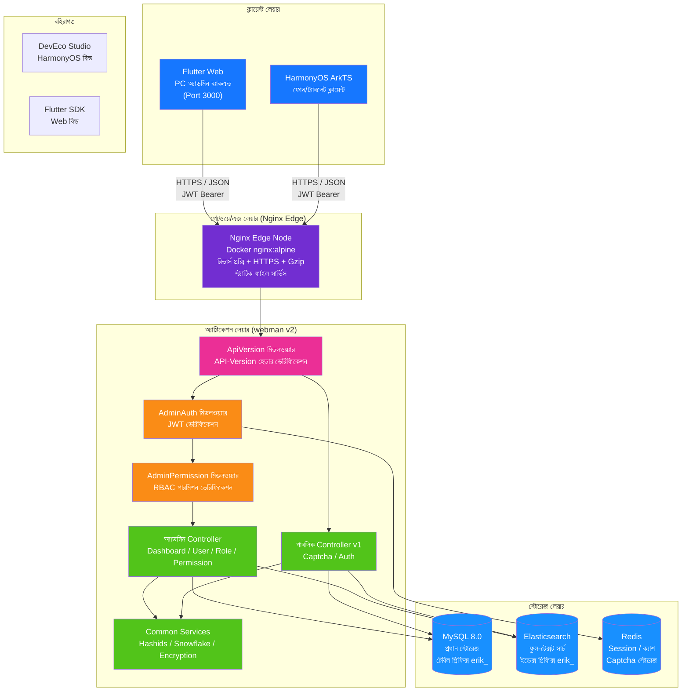

---

## 2. ব্যাকএন্ড লেয়ারড আর্কিটেকচার

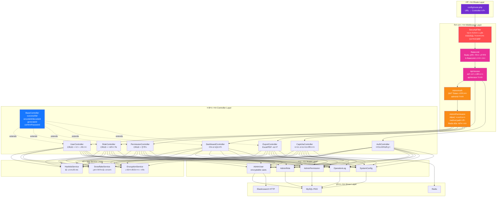

---

## 3. রিকোয়েস্ট লাইফসাইকেল

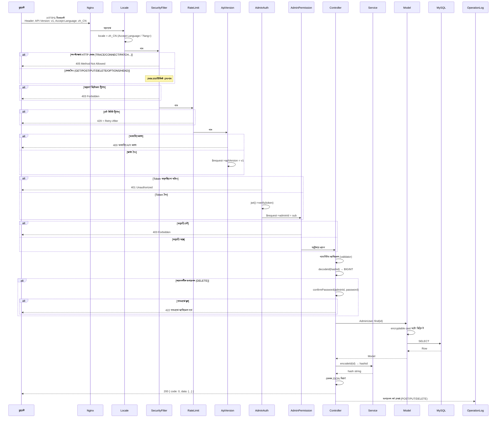

---

## 4. অথেনটিকেশন ও ক্যাপচা ফ্লো

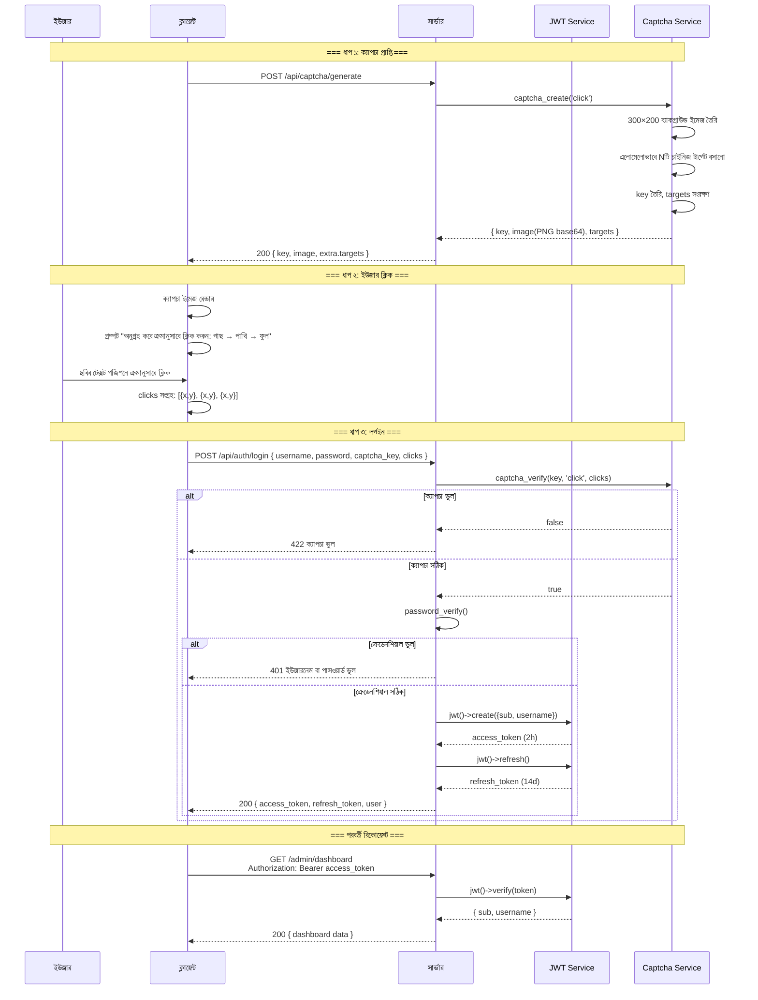

---

## 5. RBAC পারমিশন মডেল

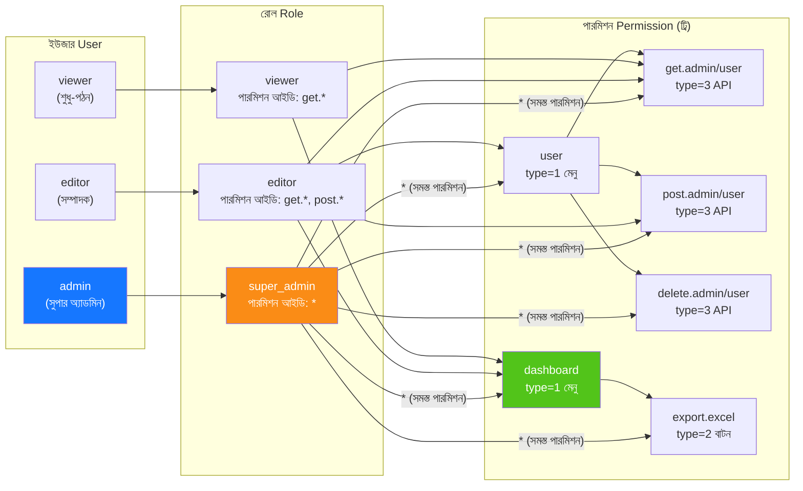

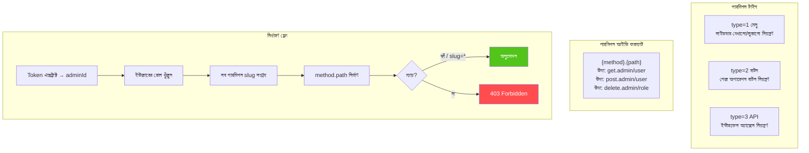

---

## 6. ID পূর্ণ লাইফসাইকেল

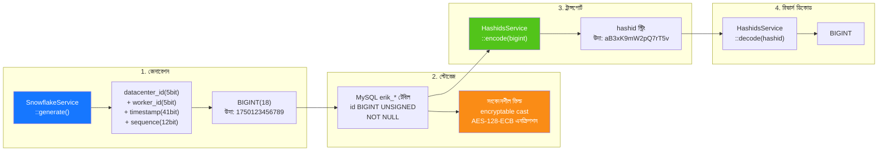

---

## 7. ডেটা এনক্রিপশন লেয়ারিং

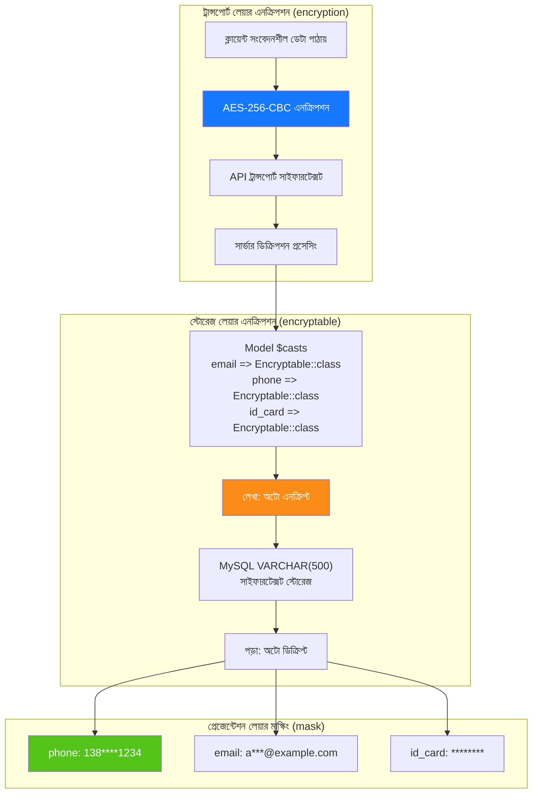

---

## 8. ডেটাবেস ER সম্পর্ক

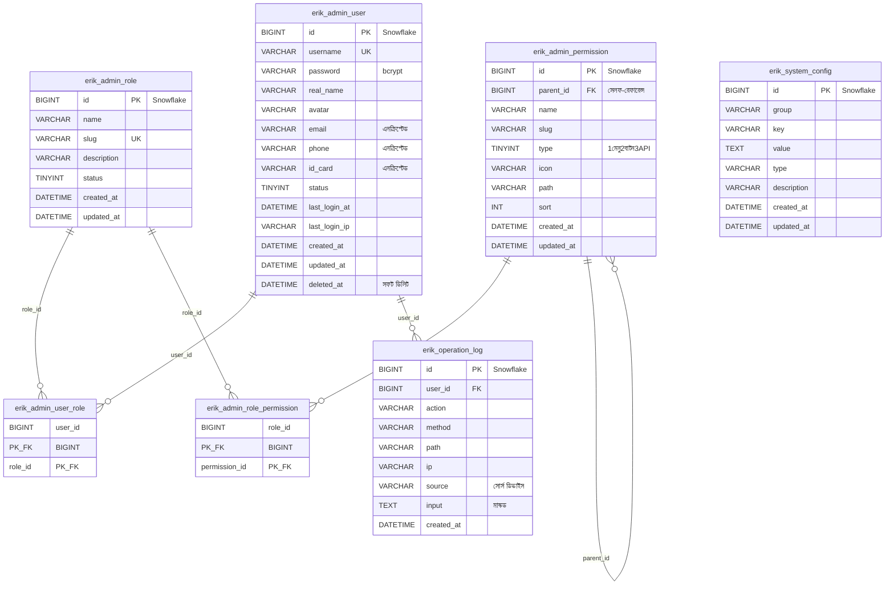

---

## 9. এক্সপোর্ট বিজনেস ফ্লো

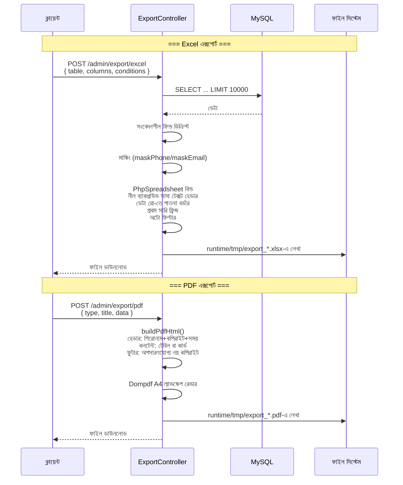

---

## 10. Flutter Web কম্পোনেন্ট ট্রি

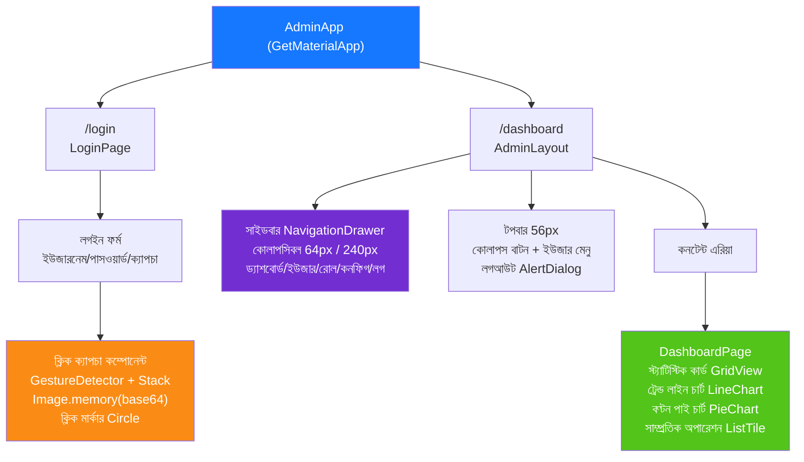

---

## 11. HarmonyOS পেজ রাউটিং

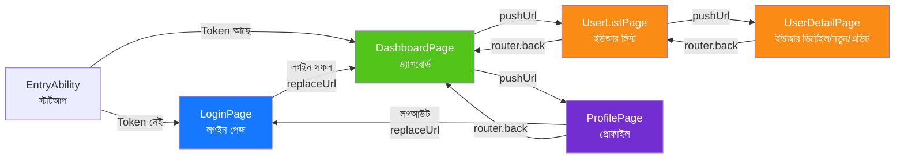

---

## 12. নিরাপত্তা গভীর প্রতিরক্ষা প্যানোরামা

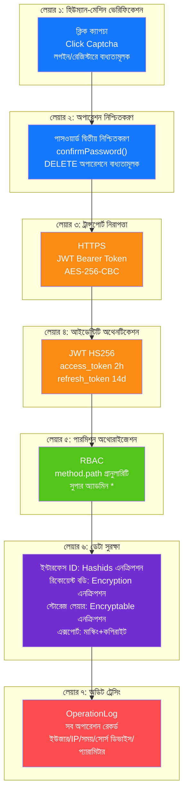

---

## 13. ডিপ্লয় টপোলজি

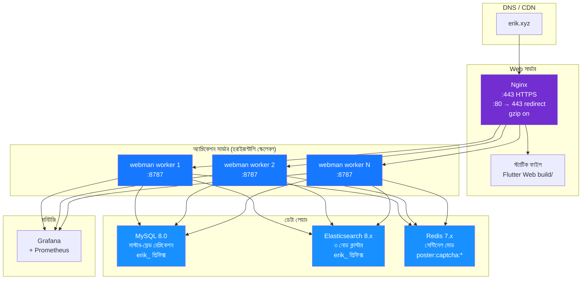
