# Diagramas de arquitectura y lógica de negocio

> Copyright (c) 2026 erik <erik@erik.xyz> — https://erik.xyz
>
> [中文](ARCHITECTURE.md) | [English](ARCHITECTURE.en.md) | [한국어](ARCHITECTURE.ko.md) | [Русский](ARCHITECTURE.ru.md) | [Deutsch](ARCHITECTURE.de.md) | [Français](ARCHITECTURE.fr.md) | [Español](ARCHITECTURE.es.md) | [Português](ARCHITECTURE.pt.md) | [हिन्दी](ARCHITECTURE.hi.md) | [العربية](ARCHITECTURE.ar.md) | [বাংলা](ARCHITECTURE.bn.md) | [Bahasa Indonesia](ARCHITECTURE.id.md) | [日本語](ARCHITECTURE.ja.md)

> Los siguientes diagramas Mermaid se renderizan automáticamente en GitHub / GitLab / VS Code. En otros entornos, utilice [Mermaid Live Editor](https://mermaid.live/).

---

## 1. Topología del sistema

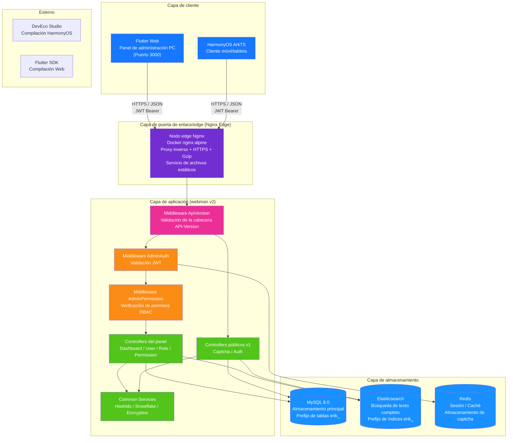

---

## 2. Arquitectura por capas del backend

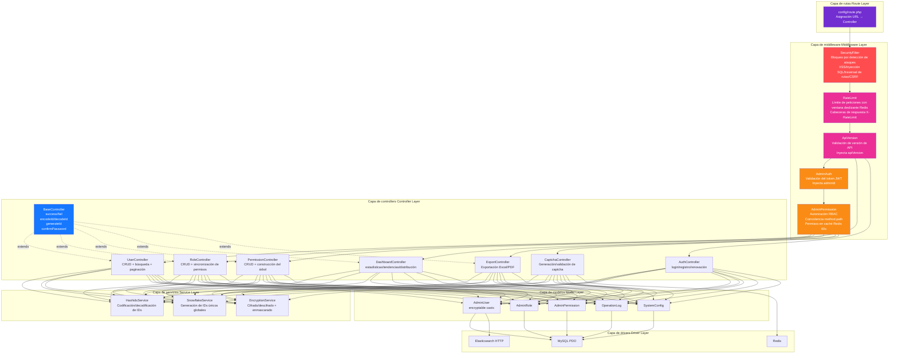

---

## 3. Ciclo de vida de una petición

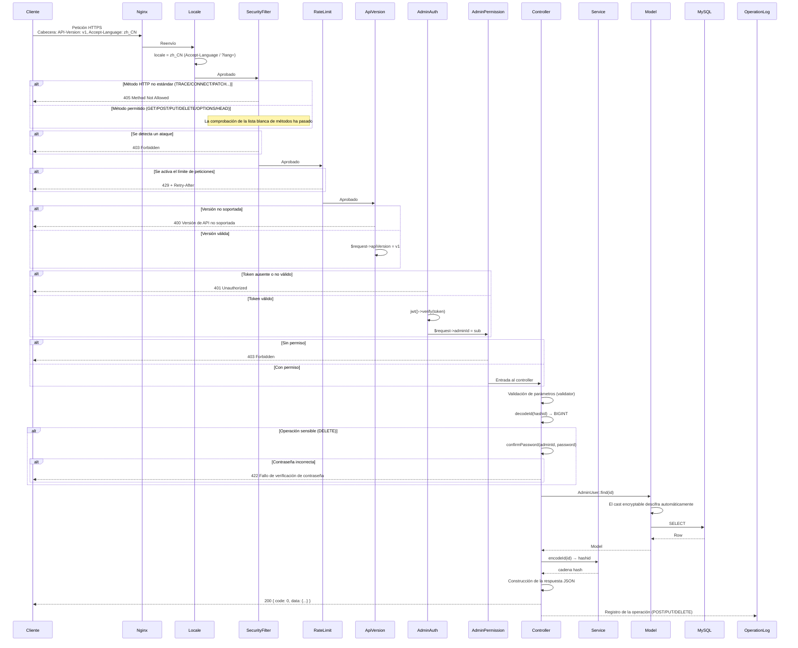

---

## 4. Flujo de autenticación y captcha

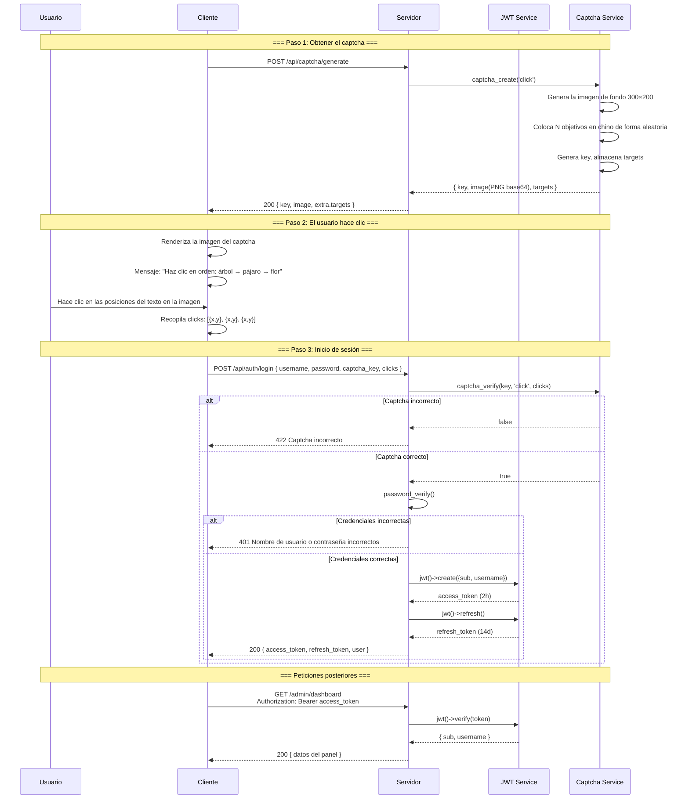

---

## 5. Modelo de permisos RBAC

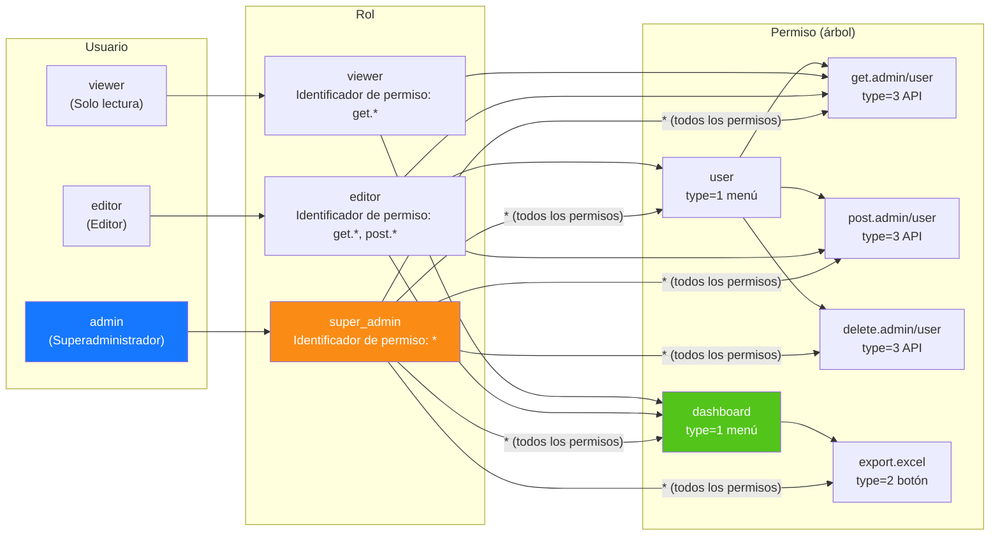

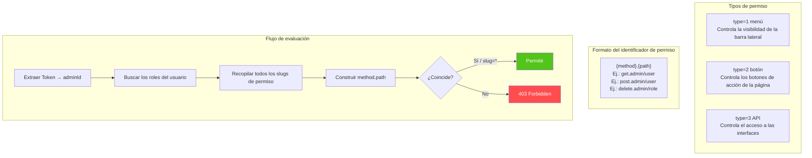

---

## 6. Ciclo de vida completo de los IDs

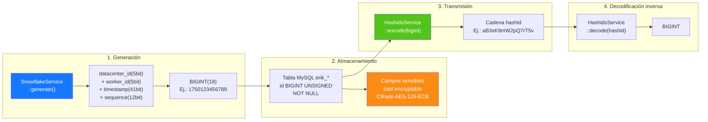

---

## 7. Capas de cifrado de datos

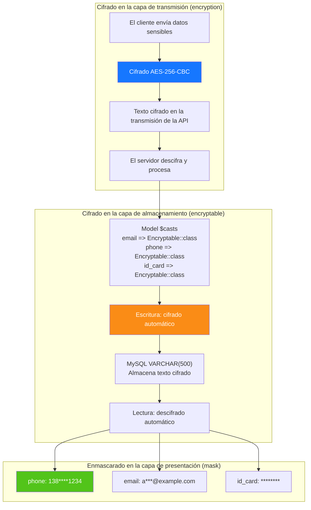

---

## 8. Relaciones ER de la base de datos

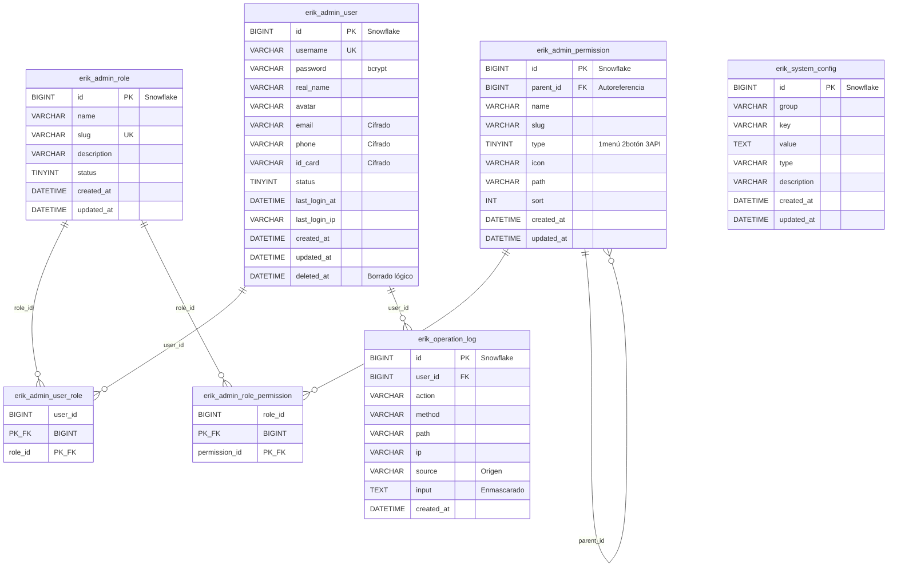

---

## 9. Flujo de negocio de la exportación

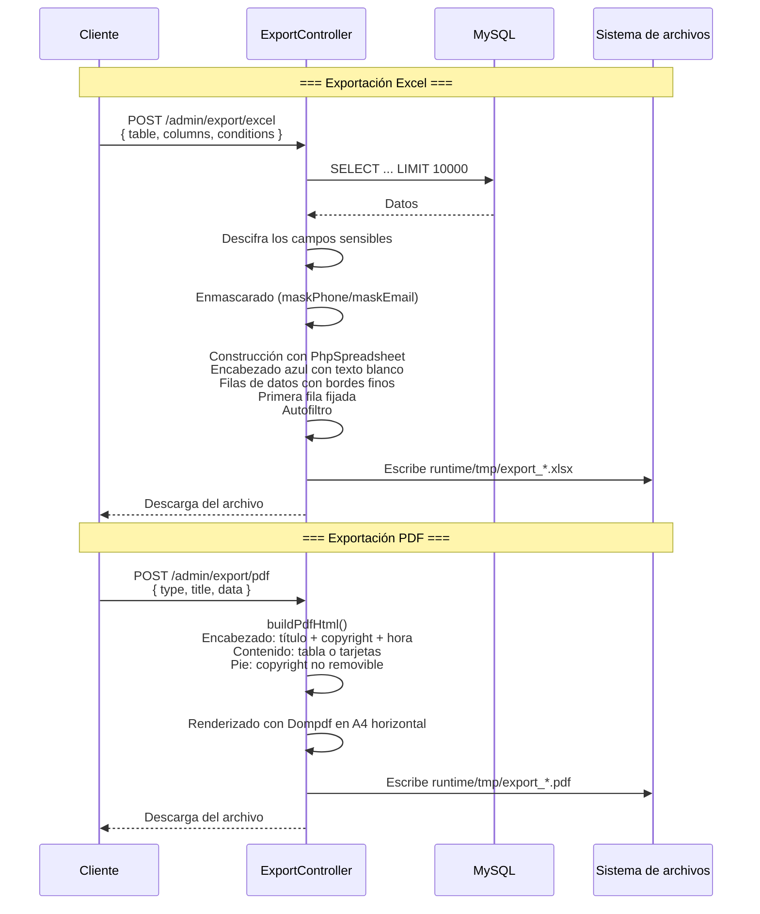

---

## 10. Árbol de componentes de Flutter Web

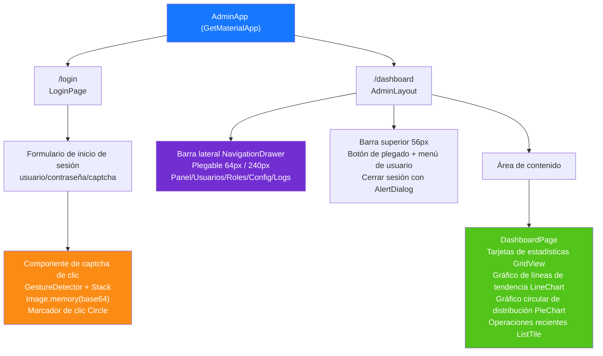

---

## 11. Rutas de páginas de HarmonyOS

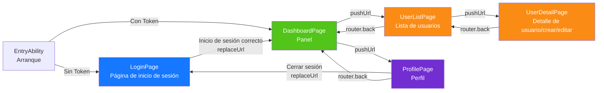

---

## 12. Panorama completo de la defensa en profundidad

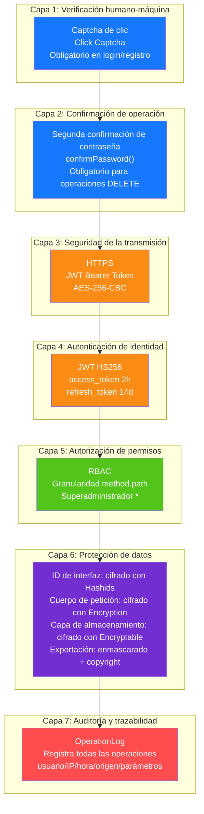

---

## 13. Topología de despliegue

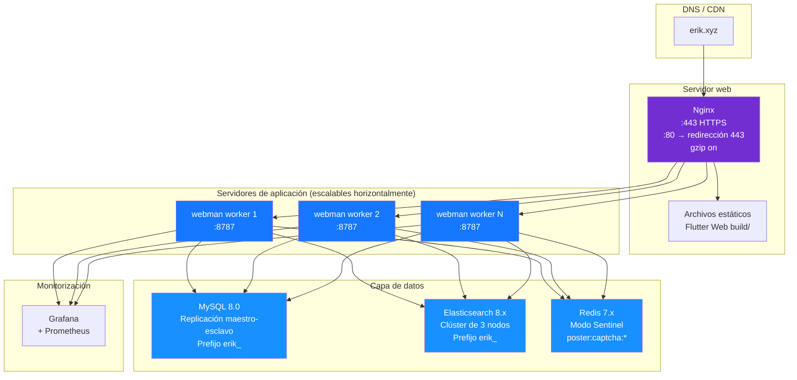
