> Copyright (c) 2026 erik <erik@erik.xyz> — https://erik.xyz
>
> [中文](ARCHITECTURE.md) | [English](ARCHITECTURE.en.md) | [한국어](ARCHITECTURE.ko.md) | [Русский](ARCHITECTURE.ru.md) | [Deutsch](ARCHITECTURE.de.md) | [Français](ARCHITECTURE.fr.md) | [Español](ARCHITECTURE.es.md) | [Português](ARCHITECTURE.pt.md) | [हिन्दी](ARCHITECTURE.hi.md) | [العربية](ARCHITECTURE.ar.md) | [বাংলা](ARCHITECTURE.bn.md) | [Bahasa Indonesia](ARCHITECTURE.id.md) | [日本語](ARCHITECTURE.ja.md)

# Diagrammes d'architecture et de logique métier

> Les diagrammes Mermaid ci-dessous sont automatiquement rendus dans GitHub / GitLab / VS Code. Pour les autres environnements, utilisez [Mermaid Live Editor](https://mermaid.live/).

---

## 1. Topologie du système

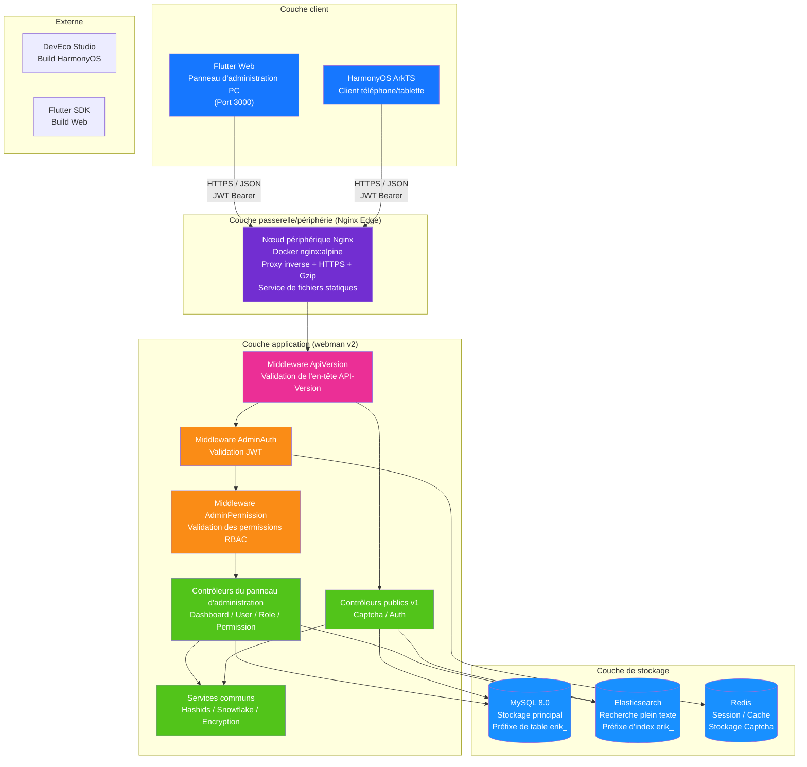

---

## 2. Architecture backend en couches

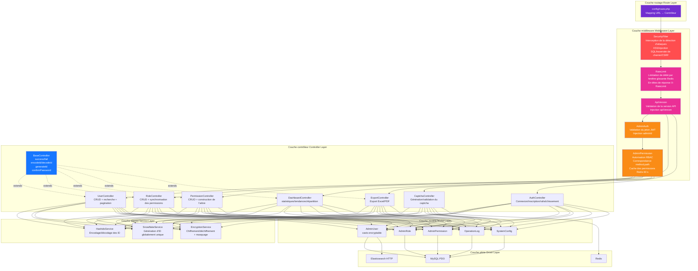

---

## 3. Cycle de vie d'une requête

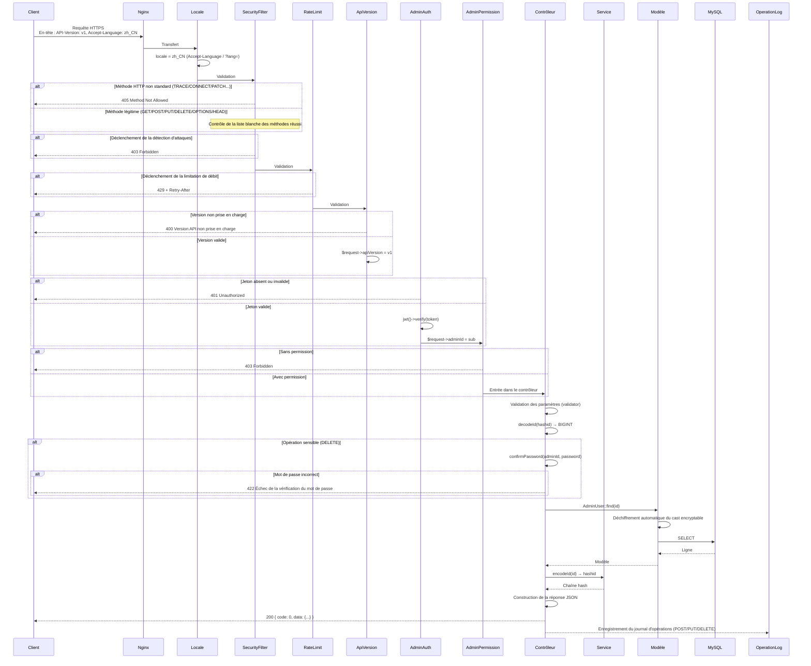

---

## 4. Flux d'authentification et de captcha

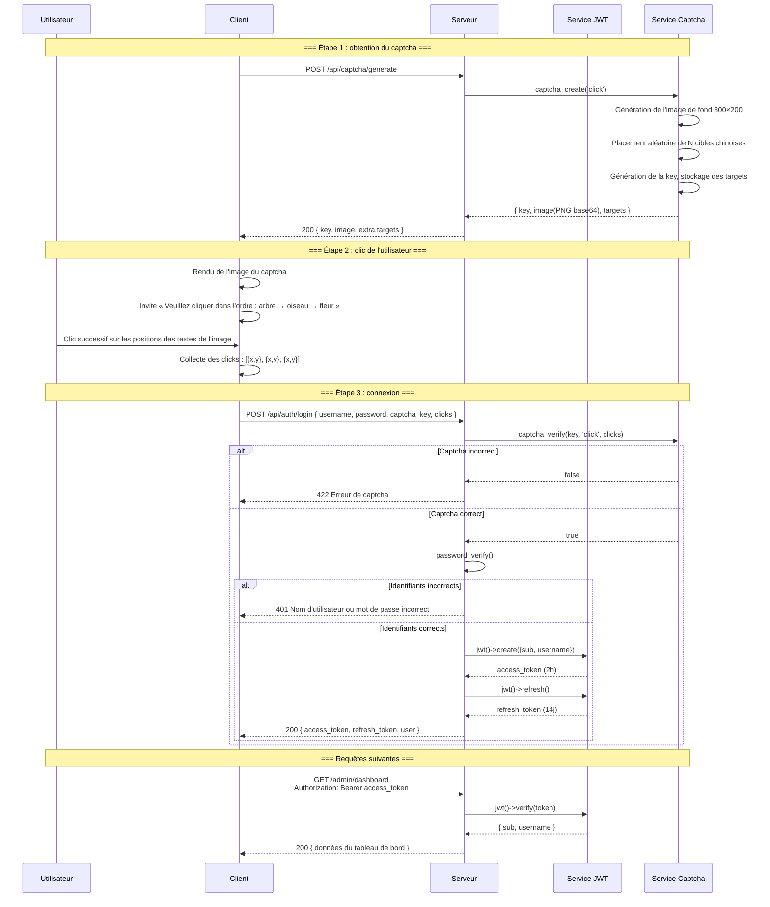

---

## 5. Modèle de permissions RBAC

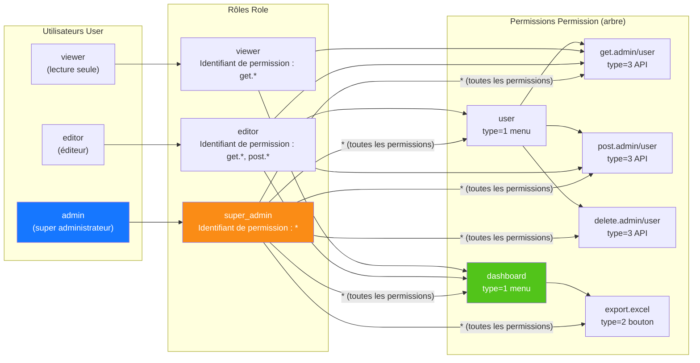

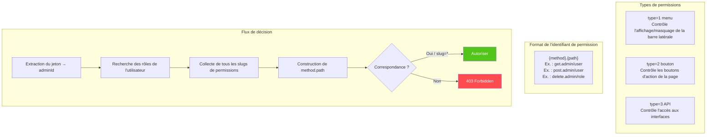

---

## 6. Cycle de vie complet des ID

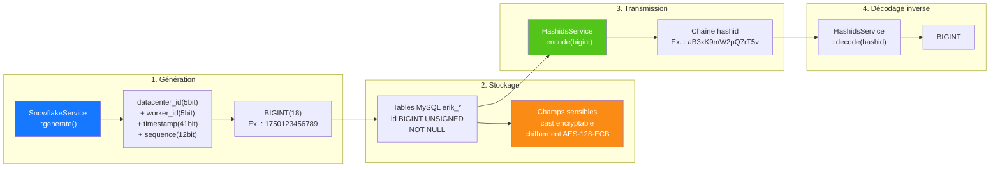

---

## 7. Couches de chiffrement des données

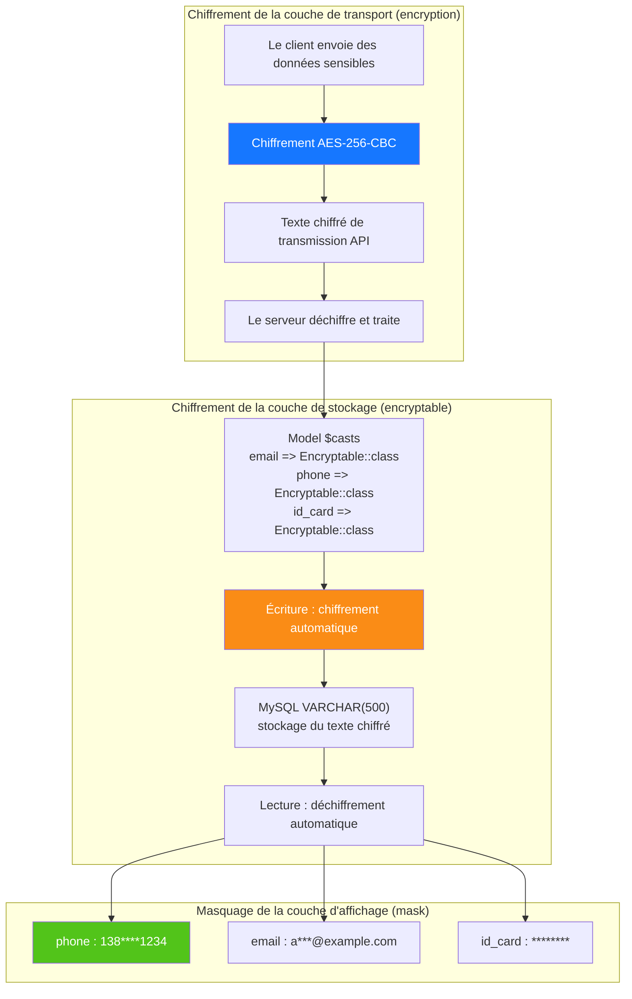

---

## 8. Relations ER de la base de données

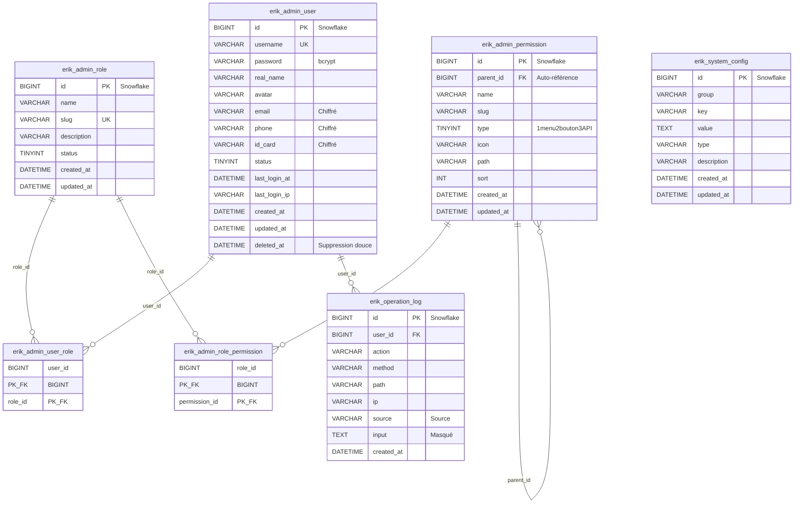

---

## 9. Processus métier d'export

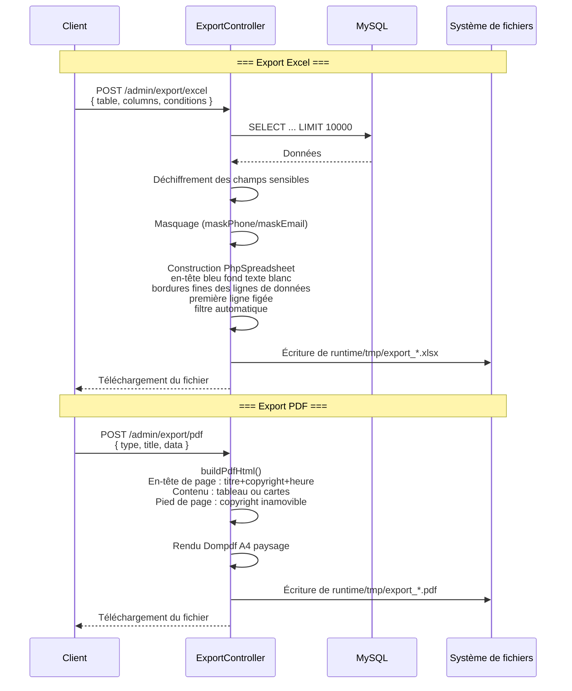

---

## 10. Arbre des composants Flutter Web

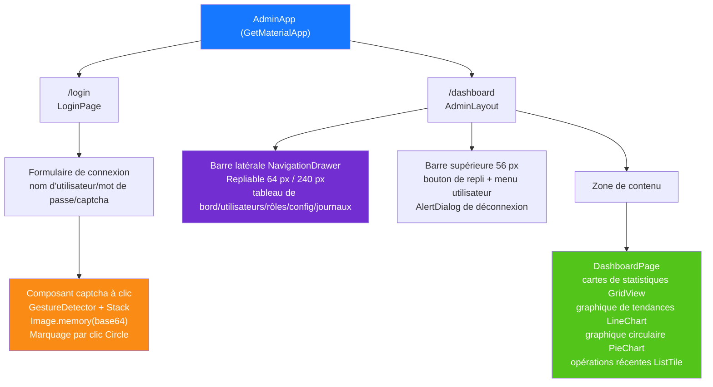

---

## 11. Routage des pages HarmonyOS

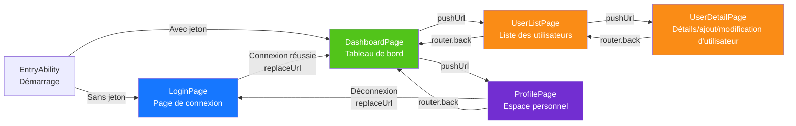

---

## 12. Panorama de la défense en profondeur

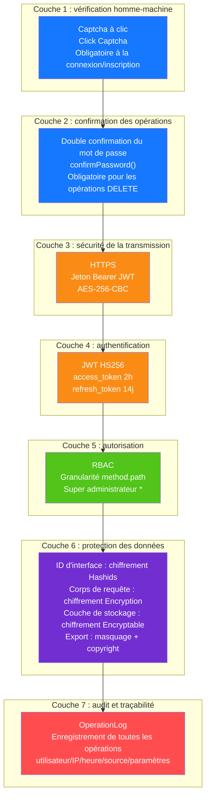

---

## 13. Topologie de déploiement

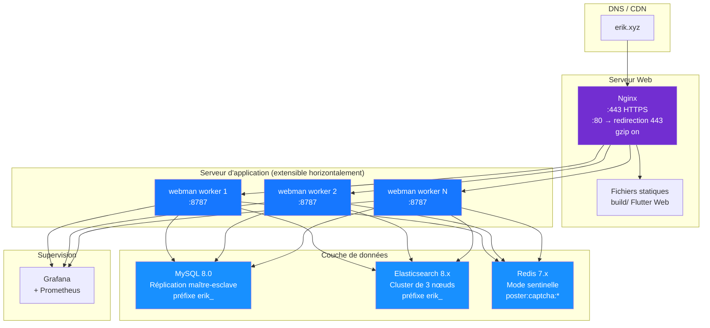
