# आर्किटेक्चर डिज़ाइन आरेख और बिज़नेस लॉजिक आरेख

> Copyright (c) 2026 erik <erik@erik.xyz> — https://erik.xyz
>
> [中文](ARCHITECTURE.md) | [English](ARCHITECTURE.en.md) | [한국어](ARCHITECTURE.ko.md) | [Русский](ARCHITECTURE.ru.md) | [Deutsch](ARCHITECTURE.de.md) | [Français](ARCHITECTURE.fr.md) | [Español](ARCHITECTURE.es.md) | [Português](ARCHITECTURE.pt.md) | [हिन्दी](ARCHITECTURE.hi.md) | [العربية](ARCHITECTURE.ar.md) | [বাংলা](ARCHITECTURE.bn.md) | [Bahasa Indonesia](ARCHITECTURE.id.md) | [日本語](ARCHITECTURE.ja.md)

> निम्न Mermaid चार्ट GitHub / GitLab / VS Code में स्वचालित रूप से रेंडर होते हैं। अन्य वातावरणों के लिए [Mermaid Live Editor](https://mermaid.live/) का उपयोग करें।

---

## 1. सिस्टम टोपोलॉजी आर्किटेक्चर

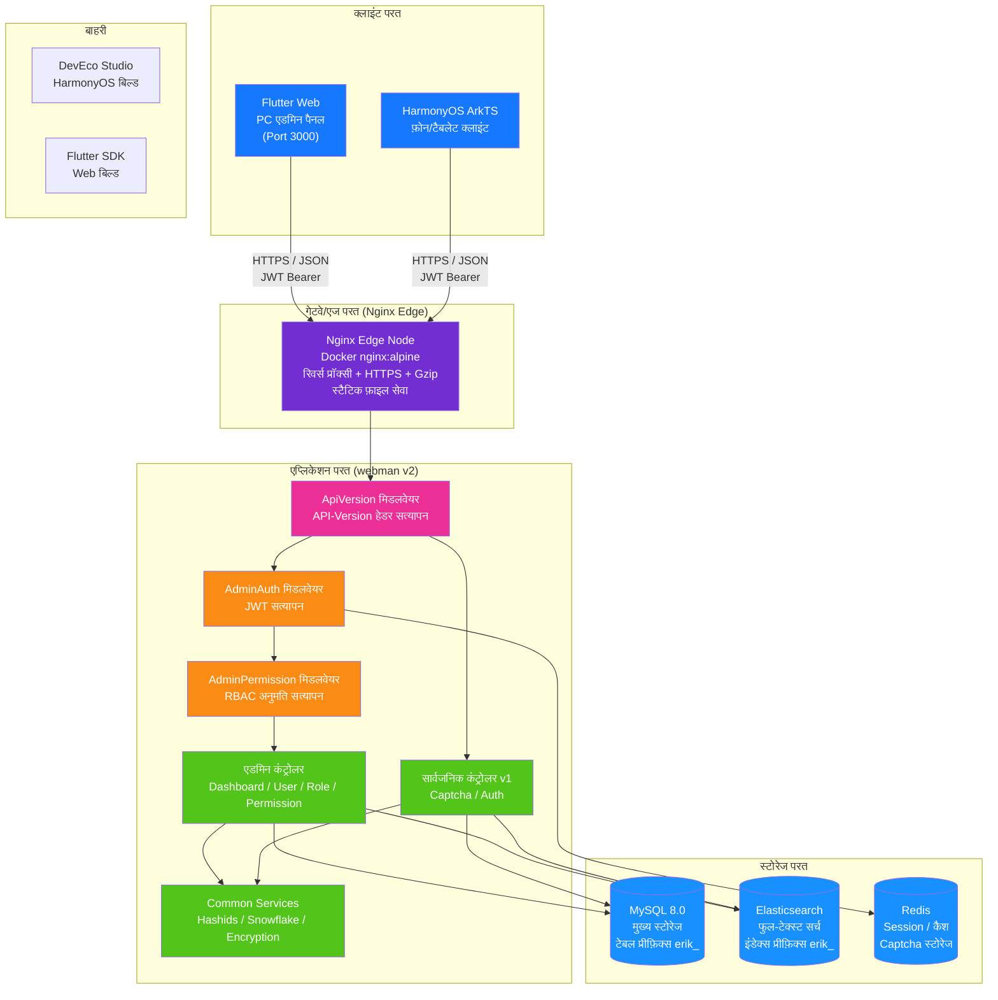

---

## 2. बैकएंड लेयर्ड आर्किटेक्चर

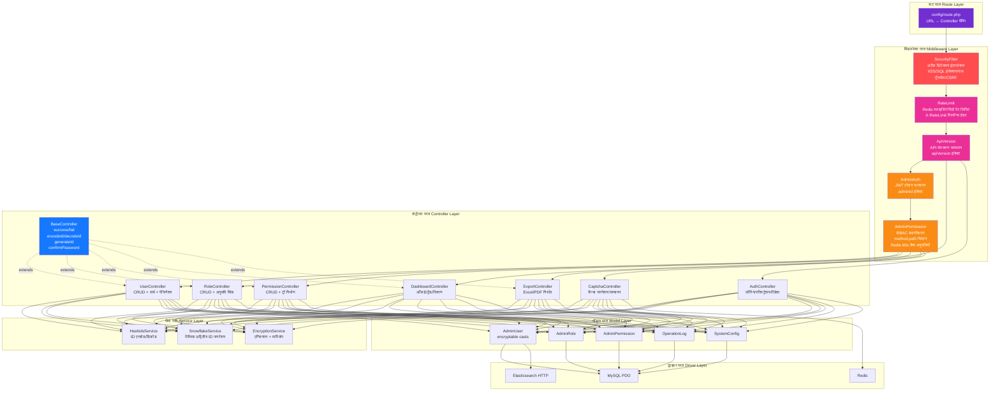

---

## 3. रिक्वेस्ट लाइफसाइकल

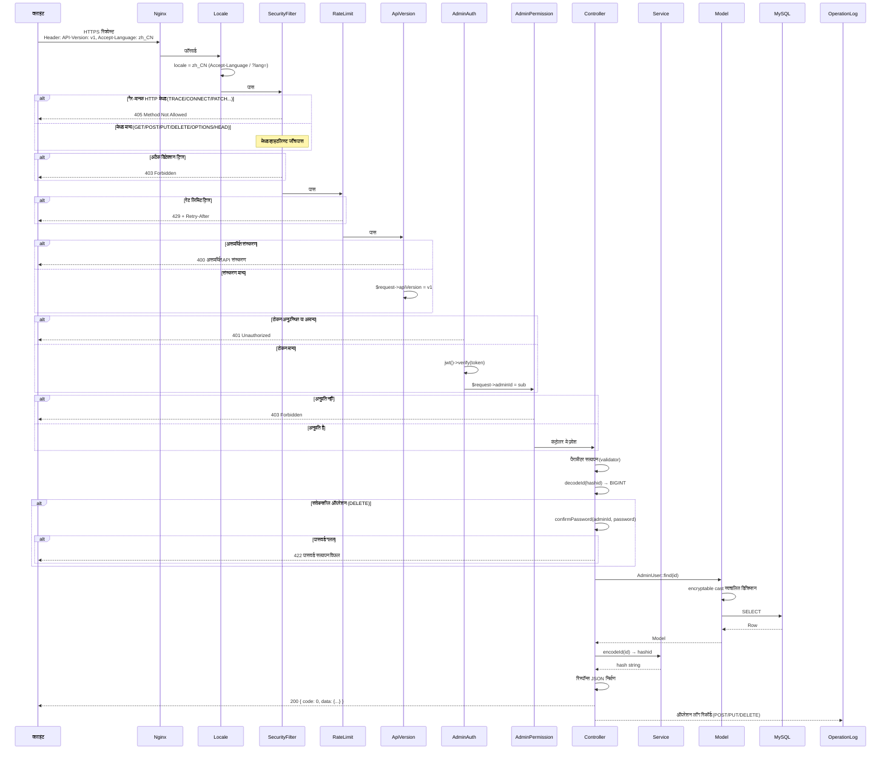

---

## 4. प्रमाणीकरण और कैप्चा प्रवाह

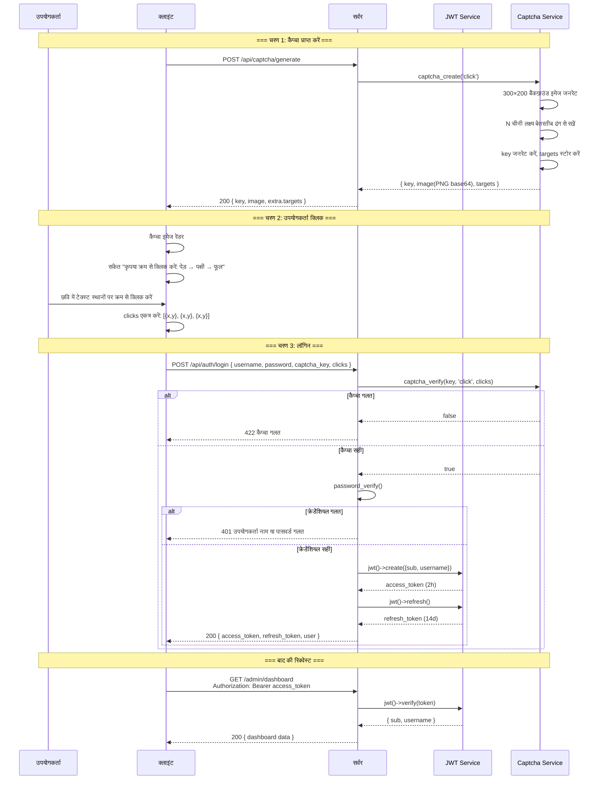

---

## 5. RBAC अनुमति मॉडल

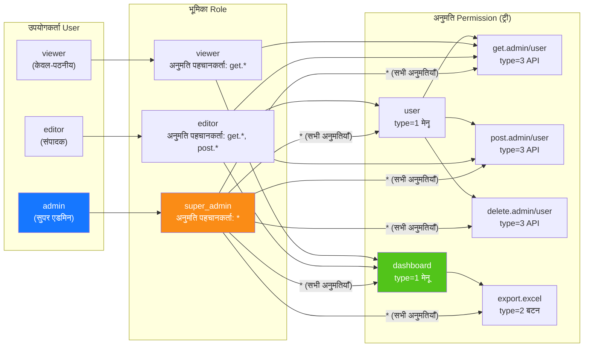

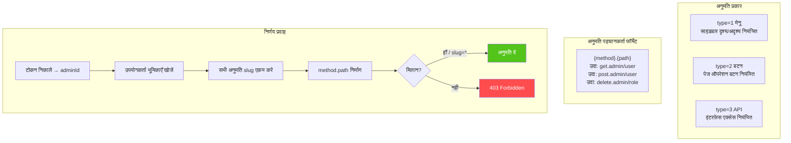

---

## 6. ID संपूर्ण लाइफसाइकल

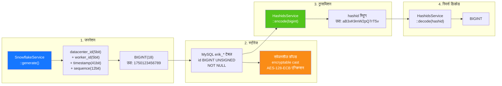

---

## 7. डेटा एन्क्रिप्शन लेयरिंग

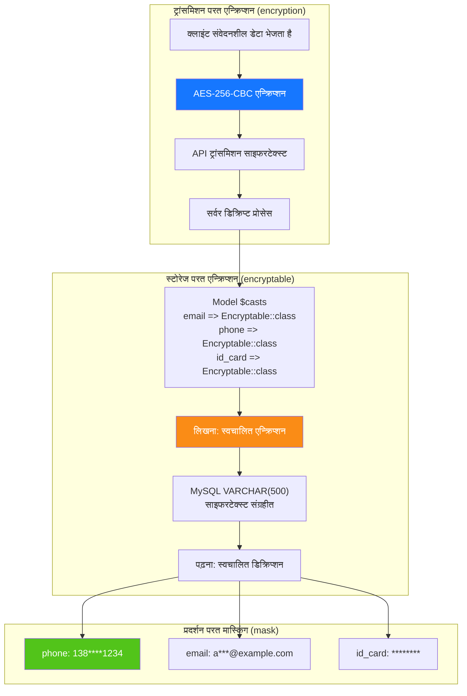

---

## 8. डेटाबेस ER संबंध

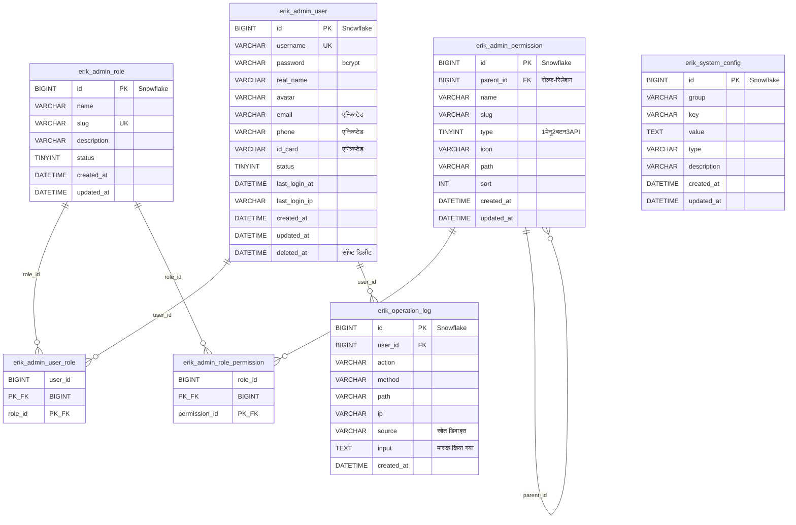

---

## 9. निर्यात बिज़नेस प्रवाह

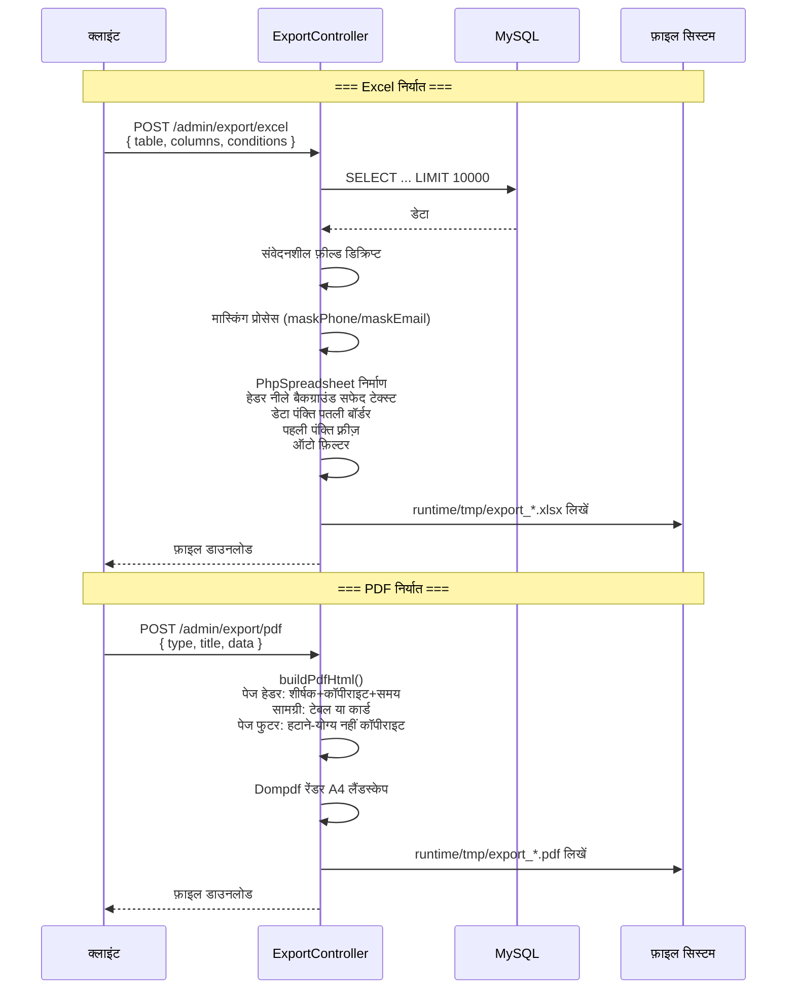

---

## 10. Flutter Web कंपोनेंट ट्री

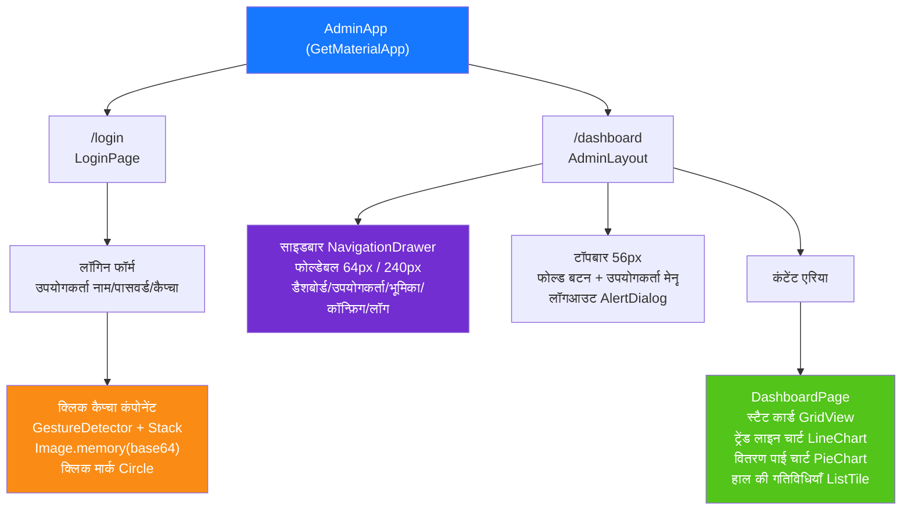

---

## 11. HarmonyOS पेज रूटिंग

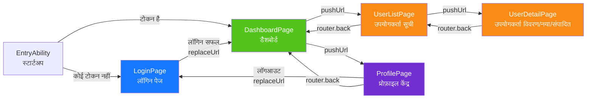

---

## 12. सुरक्षा गहन सुरक्षा पैनोरमा

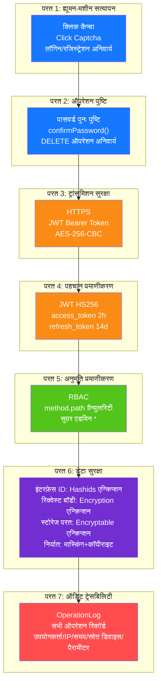

---

## 13. डिप्लॉयमेंट टोपोलॉजी

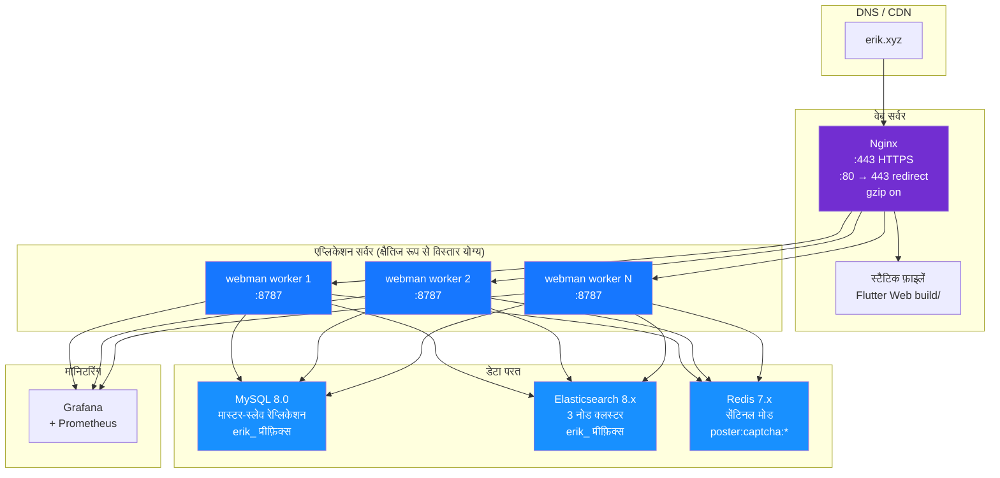
