> Copyright (c) 2026 erik <erik@erik.xyz> — https://erik.xyz
>
> [中文](ARCHITECTURE.md) | [English](ARCHITECTURE.en.md) | [한국어](ARCHITECTURE.ko.md) | [Русский](ARCHITECTURE.ru.md) | [Deutsch](ARCHITECTURE.de.md) | [Français](ARCHITECTURE.fr.md) | [Español](ARCHITECTURE.es.md) | [Português](ARCHITECTURE.pt.md) | [हिन्दी](ARCHITECTURE.hi.md) | [العربية](ARCHITECTURE.ar.md) | [বাংলা](ARCHITECTURE.bn.md) | [Bahasa Indonesia](ARCHITECTURE.id.md) | [日本語](ARCHITECTURE.ja.md)

# Diagram Arsitektur & Diagram Alur Bisnis

> Diagram Mermaid berikut dapat dirender otomatis di GitHub / GitLab / VS Code. Untuk lingkungan lain gunakan [Mermaid Live Editor](https://mermaid.live/).

---

## 1. Topologi Arsitektur Sistem

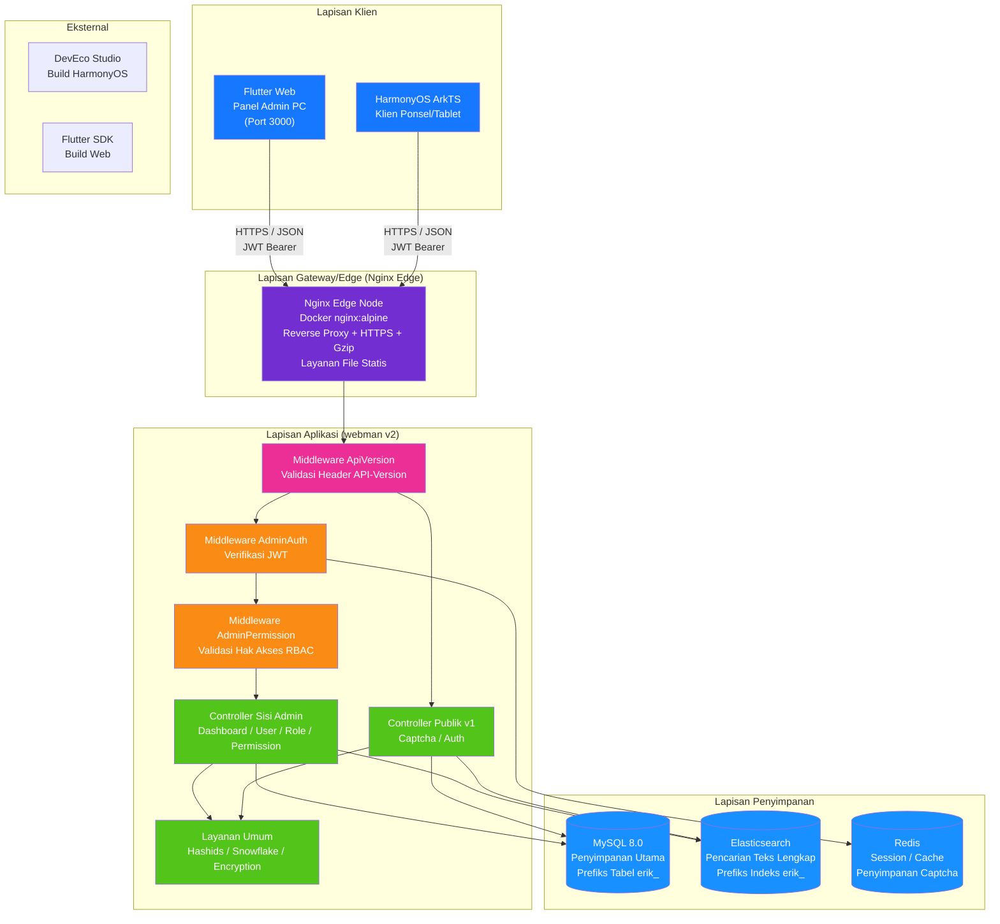

---

## 2. Arsitektur Berlapis Backend

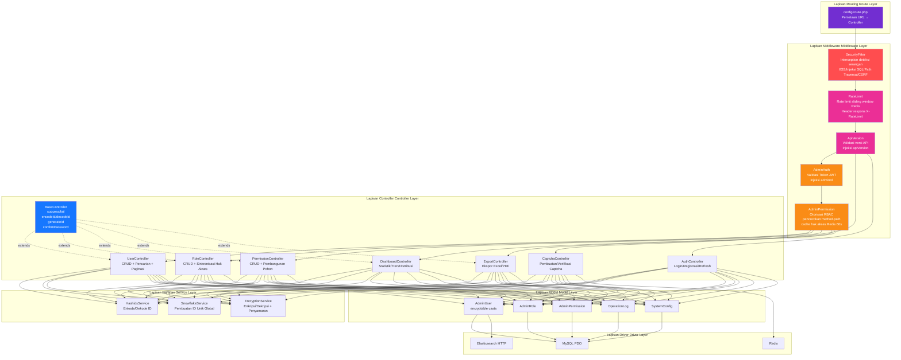

---

## 3. Siklus Hidup Permintaan

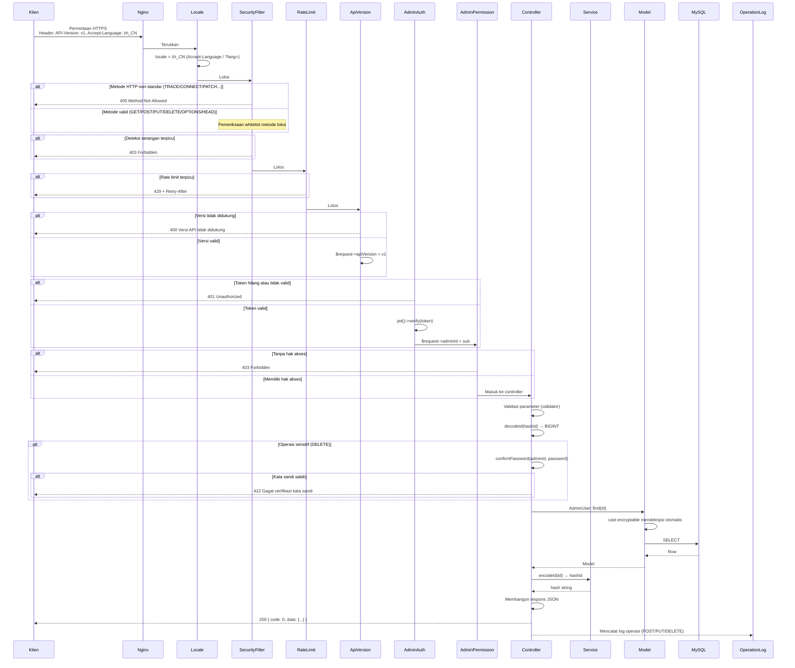

---

## 4. Alur Autentikasi & Captcha

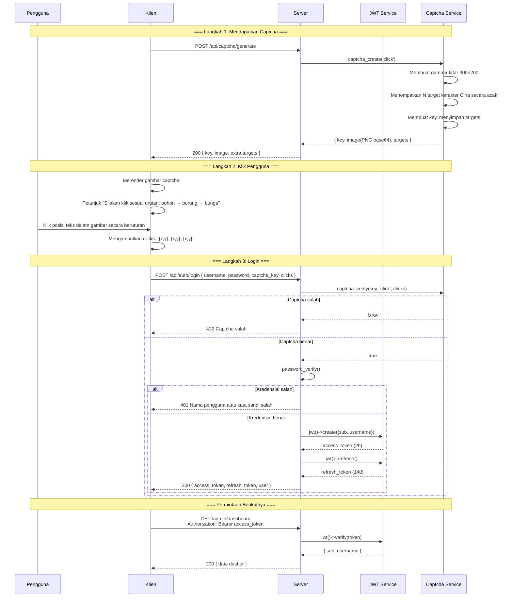

---

## 5. Model Hak Akses RBAC

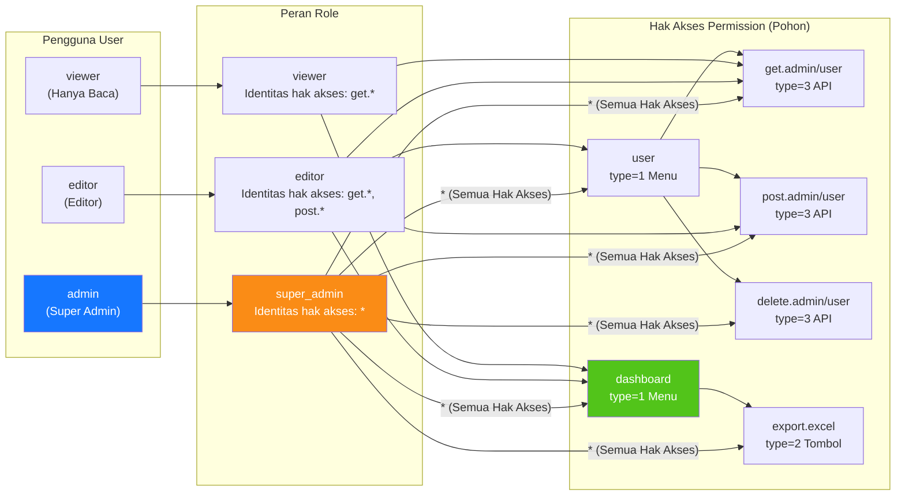

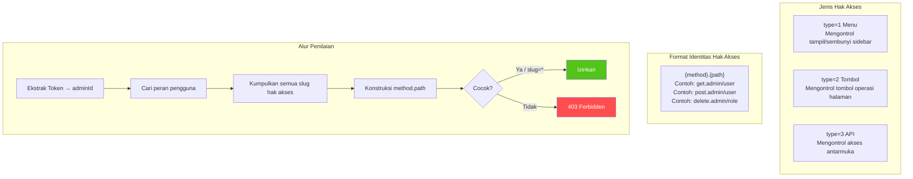

---

## 6. Siklus Hidup Lengkap ID

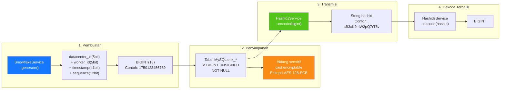

---

## 7. Lapisan Enkripsi Data

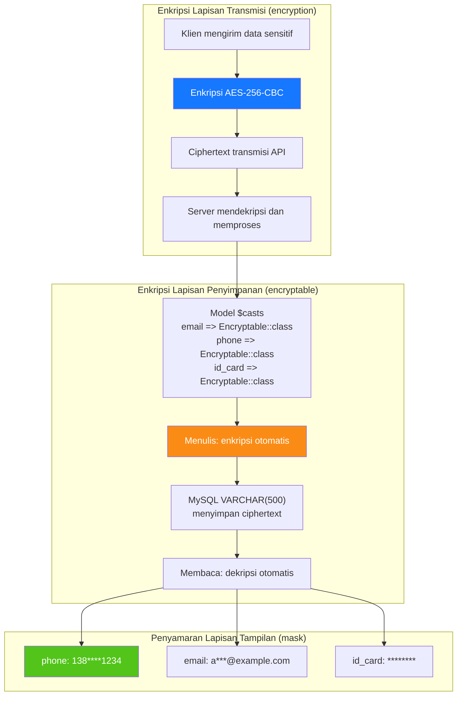

---

## 8. Relasi ER Basis Data

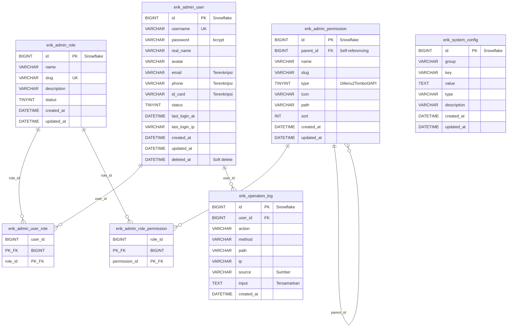

---

## 9. Alur Bisnis Ekspor

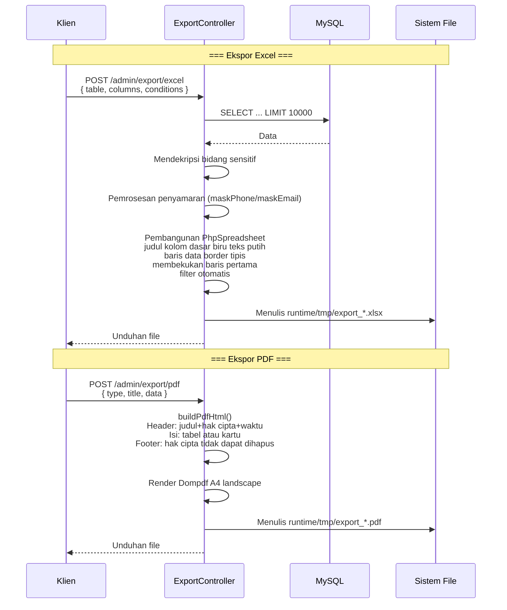

---

## 10. Pohon Komponen Flutter Web

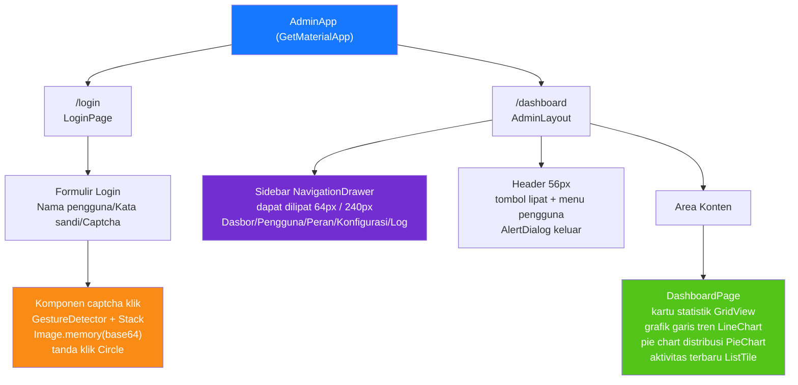

---

## 11. Routing Halaman HarmonyOS

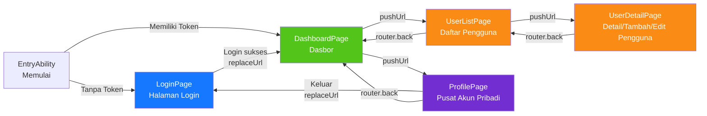

---

## 12. Panorama Pertahanan Berlapis Keamanan

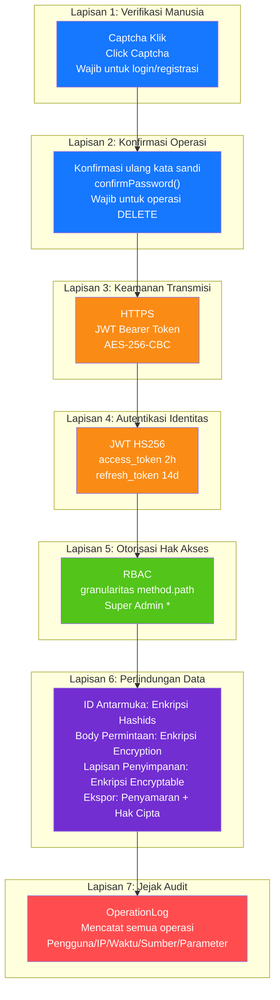

---

## 13. Topologi Deployment

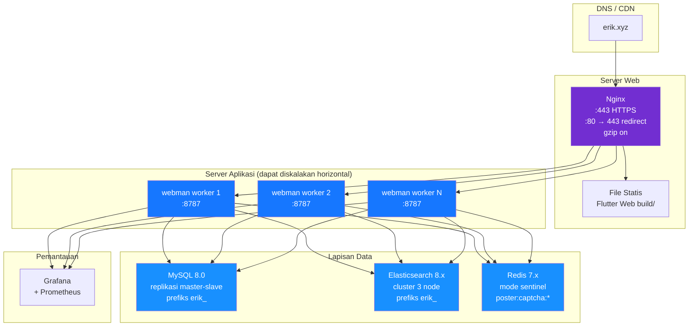
