# 아키텍처 다이어그램과 비즈니스 로직 다이어그램

> Copyright (c) 2026 erik <erik@erik.xyz> — https://erik.xyz

> [中文](ARCHITECTURE.md) | [English](ARCHITECTURE.en.md) | [한국어](ARCHITECTURE.ko.md) | [Русский](ARCHITECTURE.ru.md) | [Deutsch](ARCHITECTURE.de.md) | [Français](ARCHITECTURE.fr.md) | [Español](ARCHITECTURE.es.md) | [Português](ARCHITECTURE.pt.md) | [हिन्दी](ARCHITECTURE.hi.md) | [العربية](ARCHITECTURE.ar.md) | [বাংলা](ARCHITECTURE.bn.md) | [Bahasa Indonesia](ARCHITECTURE.id.md) | [日本語](ARCHITECTURE.ja.md)

> 아래 Mermaid 차트는 GitHub / GitLab / VS Code에서 자동으로 렌더링됩니다. 다른 환경에서는 [Mermaid Live Editor](https://mermaid.live/)를 사용하세요.

---

## 1. 시스템 토폴로지 아키텍처

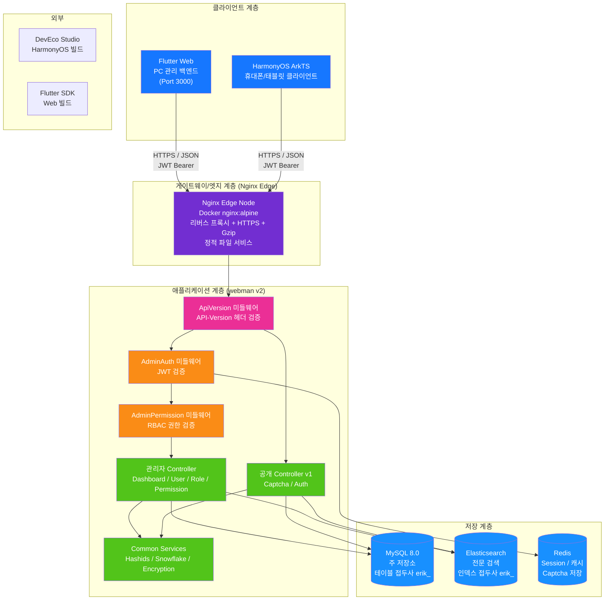

---

## 2. 백엔드 계층 아키텍처

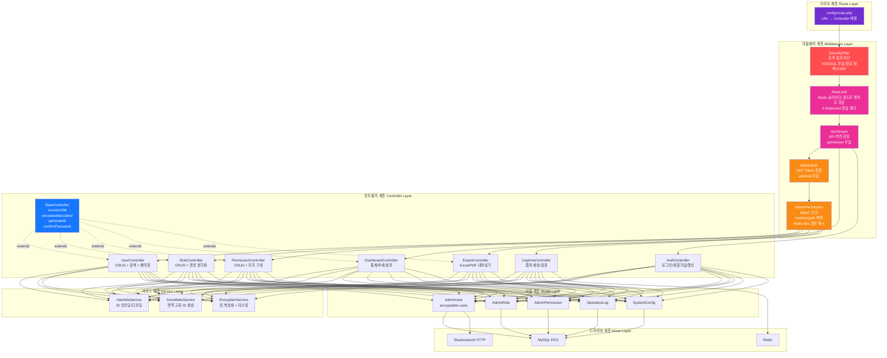

---

## 3. 요청 수명 주기

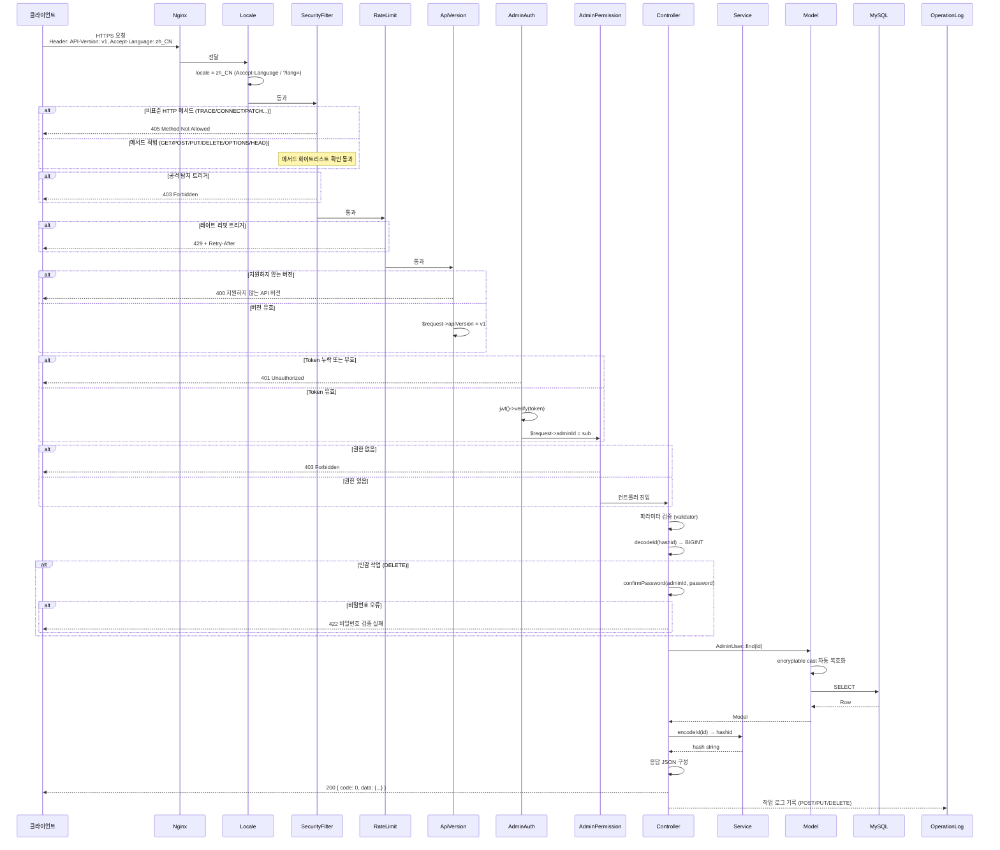

---

## 4. 인증 및 캡차 흐름

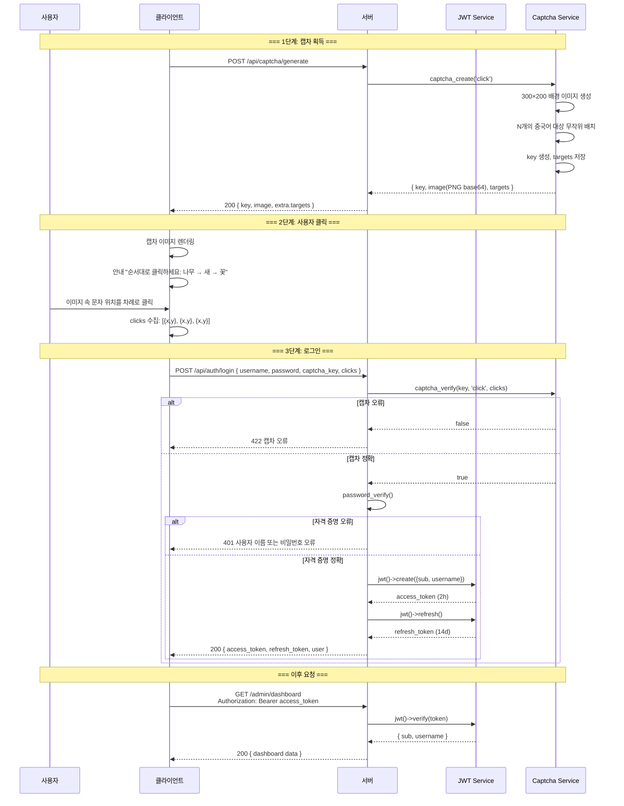

---

## 5. RBAC 권한 모델

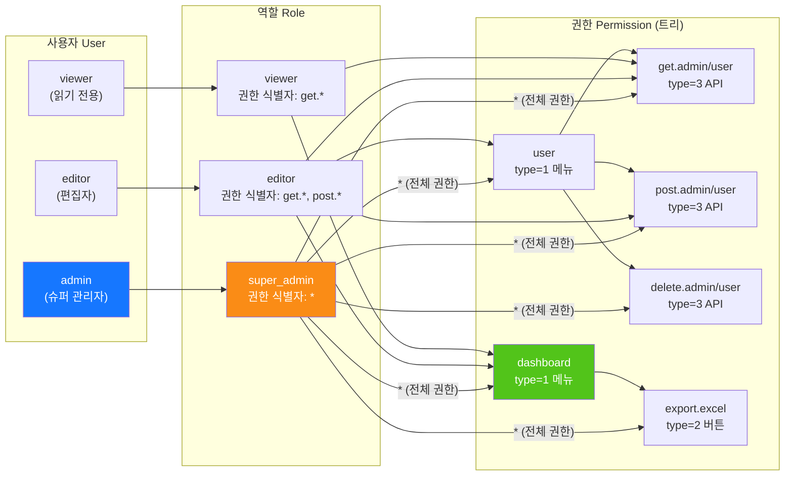

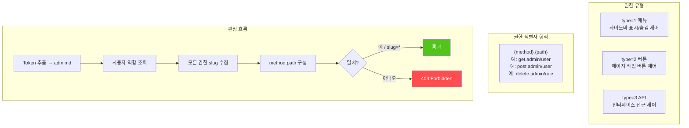

---

## 6. ID 전체 수명 주기

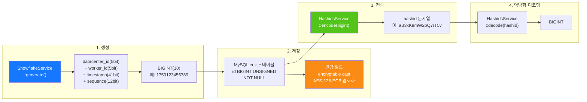

---

## 7. 데이터 암호화 계층

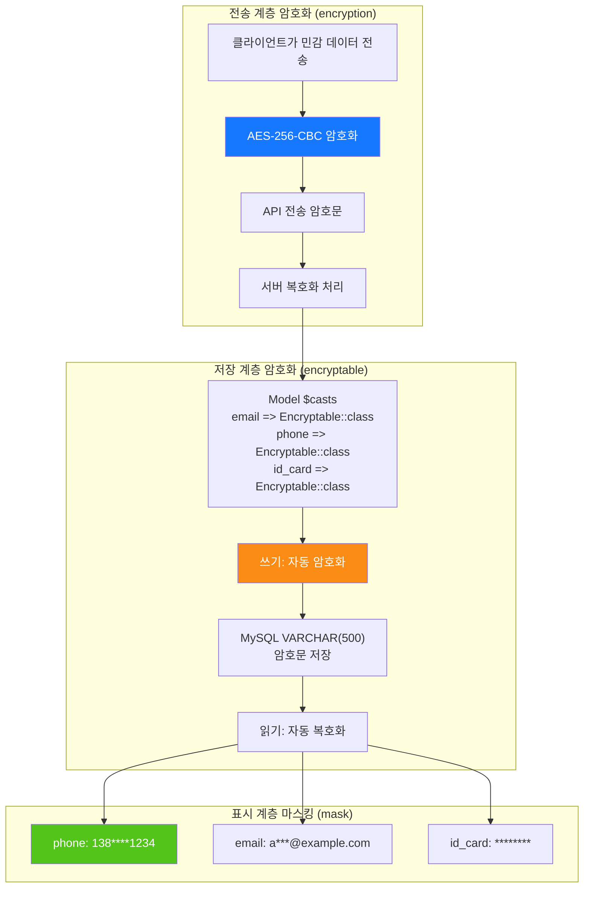

---

## 8. 데이터베이스 ER 관계

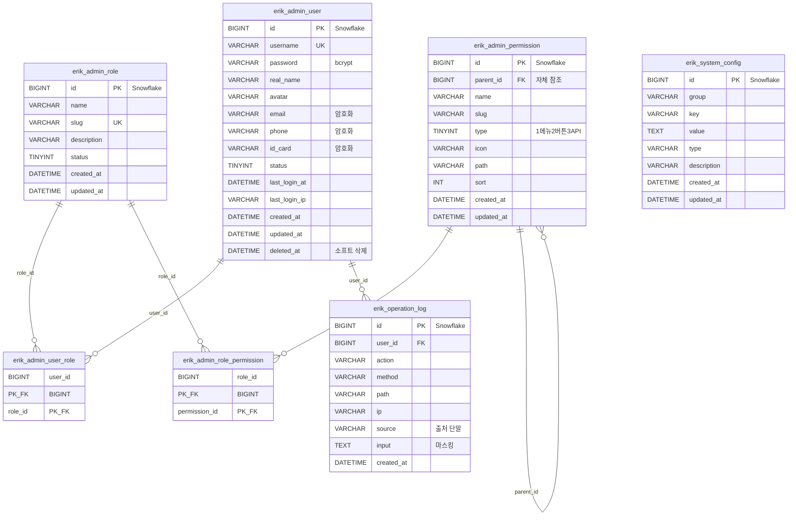

---

## 9. 내보내기 비즈니스 흐름

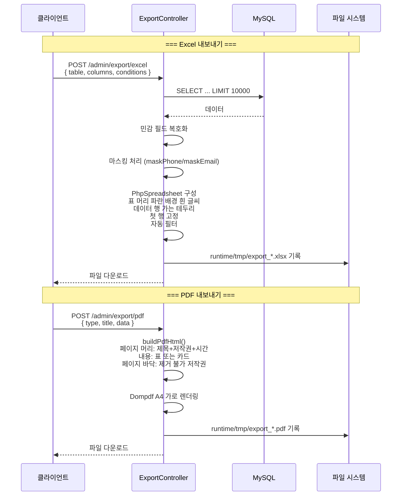

---

## 10. Flutter Web 컴포넌트 트리

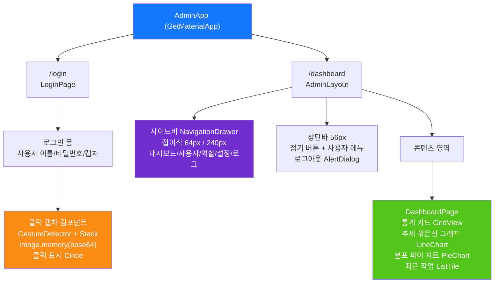

---

## 11. HarmonyOS 페이지 라우팅

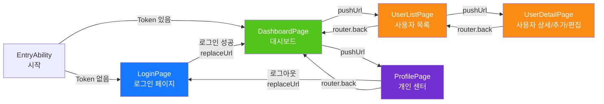

---

## 12. 보안 심층 방어 전경

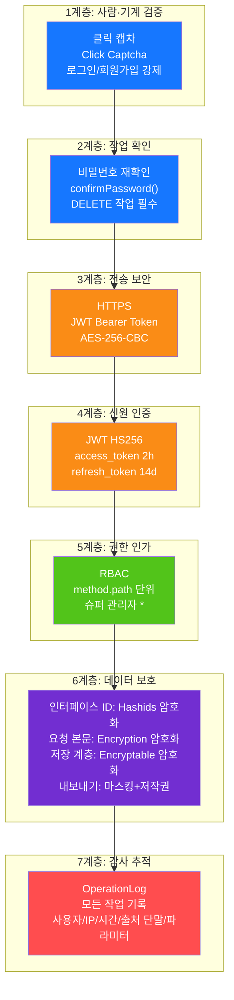

---

## 13. 배포 토폴로지

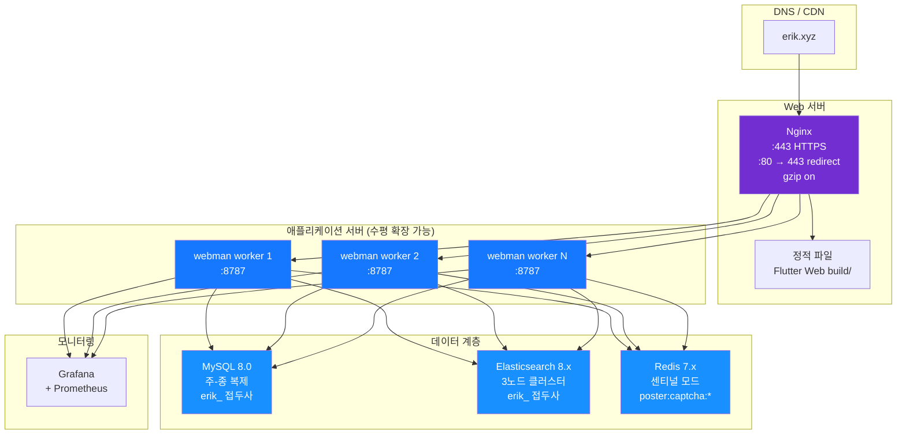
