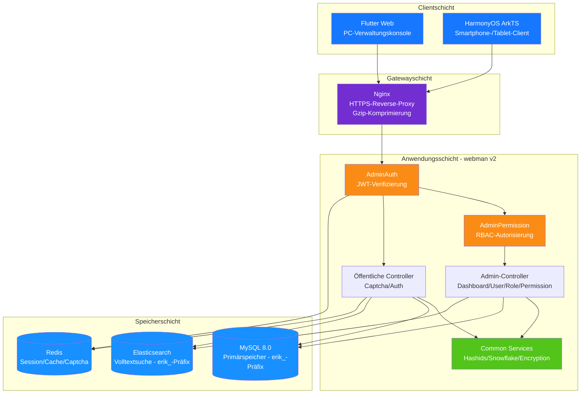

> Copyright (c) 2026 erik <erik@erik.xyz> — https://erik.xyz
>
> [中文](01-system-architecture.md) | [English](01-system-architecture.en.md) | [한국어](01-system-architecture.ko.md) | [Русский](01-system-architecture.ru.md) | [Deutsch](01-system-architecture.de.md) | [Français](01-system-architecture.fr.md) | [Español](01-system-architecture.es.md) | [Português](01-system-architecture.pt.md) | [हिन्दी](01-system-architecture.hi.md) | [العربية](01-system-architecture.ar.md) | [বাংলা](01-system-architecture.bn.md) | [Bahasa Indonesia](01-system-architecture.id.md) | [日本語](01-system-architecture.ja.md)

# Systemarchitektur (Topologie)

