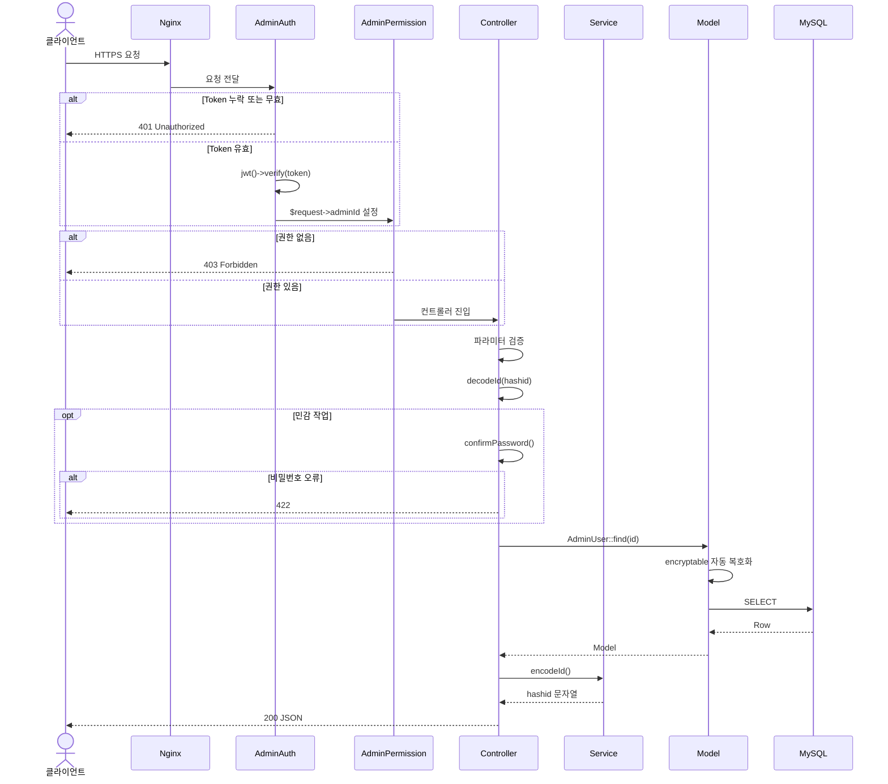

> Copyright (c) 2026 erik <erik@erik.xyz> — https://erik.xyz
>
> [中文](03-request-lifecycle.md) | [English](03-request-lifecycle.en.md) | [한국어](03-request-lifecycle.ko.md) | [Русский](03-request-lifecycle.ru.md) | [Deutsch](03-request-lifecycle.de.md) | [Français](03-request-lifecycle.fr.md) | [Español](03-request-lifecycle.es.md) | [Português](03-request-lifecycle.pt.md) | [हिन्दी](03-request-lifecycle.hi.md) | [العربية](03-request-lifecycle.ar.md) | [বাংলা](03-request-lifecycle.bn.md) | [Bahasa Indonesia](03-request-lifecycle.id.md) | [日本語](03-request-lifecycle.ja.md)

# 요청 수명주기

