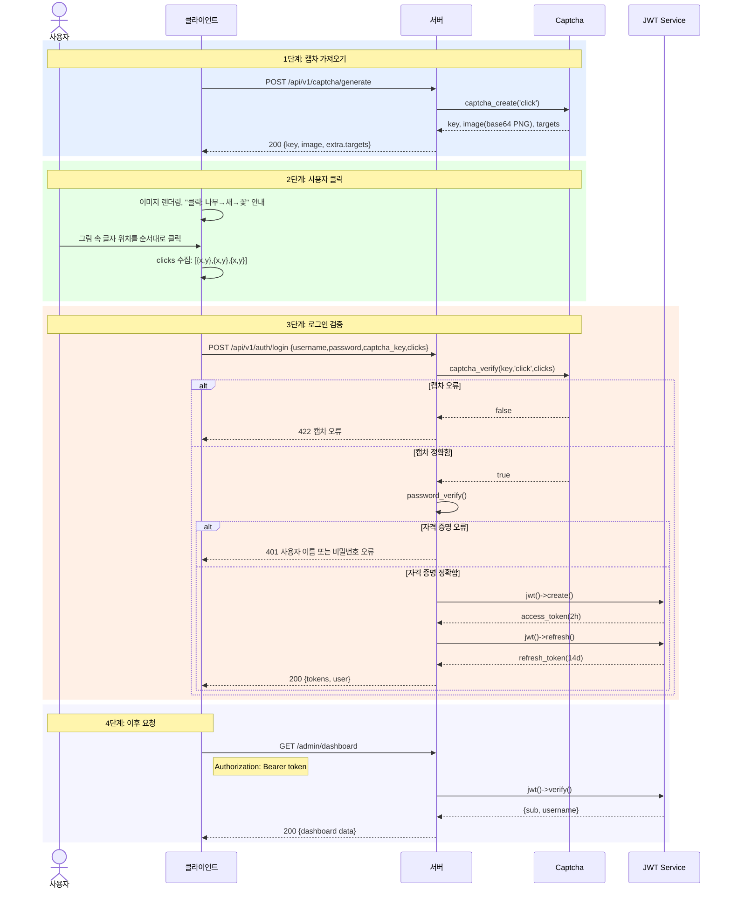

> Copyright (c) 2026 erik <erik@erik.xyz> — https://erik.xyz
>
> [中文](04-auth-captcha-flow.md) | [English](04-auth-captcha-flow.en.md) | [한국어](04-auth-captcha-flow.ko.md) | [Русский](04-auth-captcha-flow.ru.md) | [Deutsch](04-auth-captcha-flow.de.md) | [Français](04-auth-captcha-flow.fr.md) | [Español](04-auth-captcha-flow.es.md) | [Português](04-auth-captcha-flow.pt.md) | [हिन्दी](04-auth-captcha-flow.hi.md) | [العربية](04-auth-captcha-flow.ar.md) | [বাংলা](04-auth-captcha-flow.bn.md) | [Bahasa Indonesia](04-auth-captcha-flow.id.md) | [日本語](04-auth-captcha-flow.ja.md)

# 인증 및 캡차 흐름

