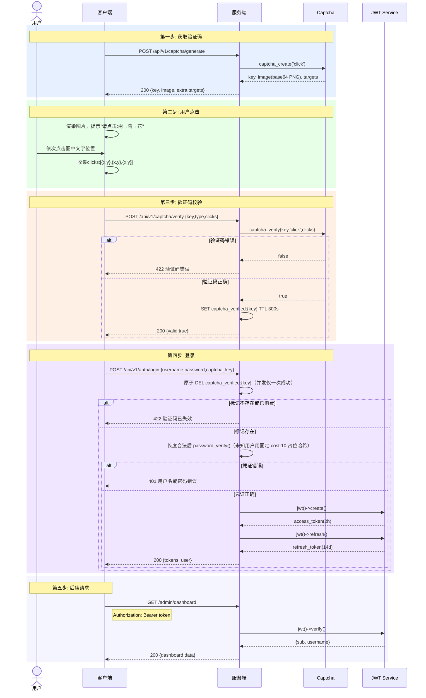

# 认证与验证码流程

```mermaid
sequenceDiagram
    actor U as 用户
    participant CL as 客户端
    participant SV as 服务端
    participant CAP as Captcha
    participant JWT as JWT Service

    rect rgb(230, 240, 255)
    Note over U,CAP: 第一步: 获取验证码
    CL->>SV: POST /api/v1/captcha/generate
    SV->>CAP: captcha_create('click')
    CAP-->>SV: key, image(base64 PNG), targets
    SV-->>CL: 200 {key, image, extra.targets}
    end

    rect rgb(230, 255, 230)
    Note over U,CAP: 第二步: 用户点击
    CL->>CL: 渲染图片，提示"请点击:树→鸟→花"
    U->>CL: 依次点击图中文字位置
    CL->>CL: 收集clicks:[{x,y},{x,y},{x,y}]
    end

    rect rgb(255, 240, 230)
    Note over U,CAP: 第三步: 验证码校验
    CL->>SV: POST /api/v1/captcha/verify {key,type,clicks}
    SV->>CAP: captcha_verify(key,'click',clicks)

    alt 验证码错误
        CAP-->>SV: false
        SV-->>CL: 422 验证码错误
    else 验证码正确
        CAP-->>SV: true
        SV->>SV: SET captcha_verified:{key} TTL 300s
        SV-->>CL: 200 {valid:true}
    end
    end

    rect rgb(240, 230, 255)
    Note over U,CAP: 第四步: 登录
    CL->>SV: POST /api/v1/auth/login {username,password,captcha_key}
    SV->>SV: 原子 DEL captcha_verified:{key}（并发仅一次成功）
    alt 标记不存在或已消费
        SV-->>CL: 422 验证码已失效
    else 标记存在
        SV->>SV: 长度合法后 password_verify()（未知用户用固定 cost-10 占位哈希）
        alt 凭证错误
            SV-->>CL: 401 用户名或密码错误
        else 凭证正确
            SV->>JWT: jwt()->create()
            JWT-->>SV: access_token(2h)
            SV->>JWT: jwt()->refresh()
            JWT-->>SV: refresh_token(14d)
            SV-->>CL: 200 {tokens, user}
        end
    end
    end

    rect rgb(245, 245, 255)
    Note over U,CL: 第五步: 后续请求
    CL->>SV: GET /admin/dashboard
    Note right of CL: Authorization: Bearer token
    SV->>JWT: jwt()->verify()
    JWT-->>SV: {sub, username}
    SV-->>CL: 200 {dashboard data}
    end
```
