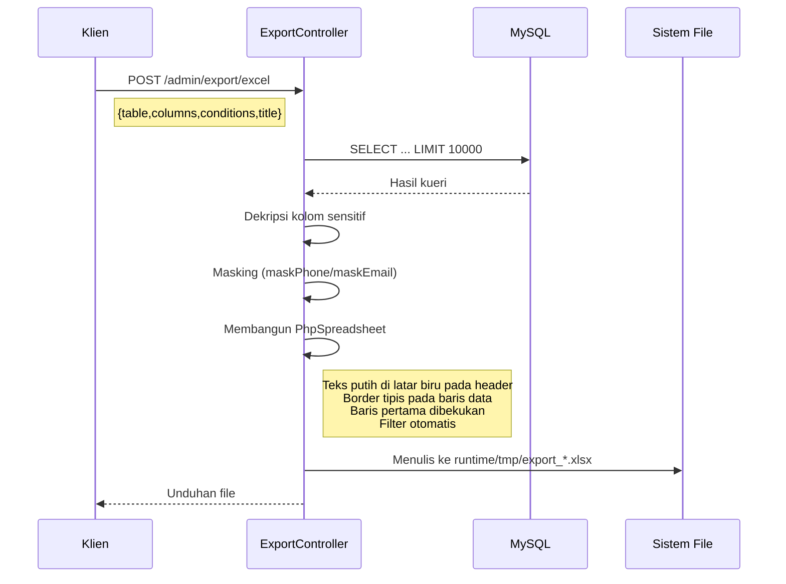
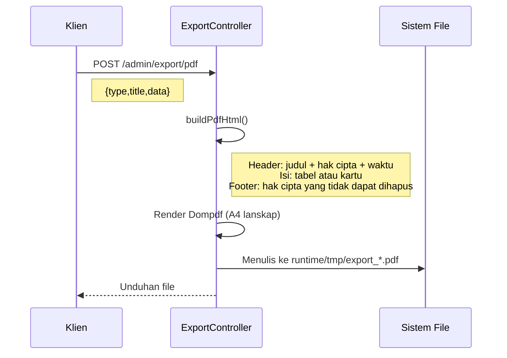

> Copyright (c) 2026 erik <erik@erik.xyz> — https://erik.xyz
>
> [中文](09-export-flow.md) | [English](09-export-flow.en.md) | [한국어](09-export-flow.ko.md) | [Русский](09-export-flow.ru.md) | [Deutsch](09-export-flow.de.md) | [Français](09-export-flow.fr.md) | [Español](09-export-flow.es.md) | [Português](09-export-flow.pt.md) | [हिन्दी](09-export-flow.hi.md) | [العربية](09-export-flow.ar.md) | [বাংলা](09-export-flow.bn.md) | [Bahasa Indonesia](09-export-flow.id.md) | [日本語](09-export-flow.ja.md)

# Alur Bisnis Ekspor

## Ekspor Excel

## Ekspor PDF

