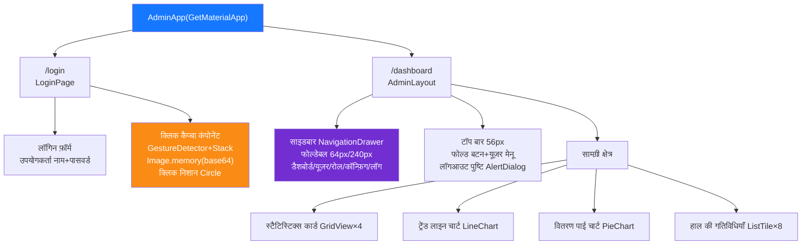
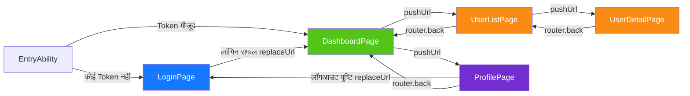

> Copyright (c) 2026 erik <erik@erik.xyz> — https://erik.xyz
>
> [中文](10-frontend-components.md) | [English](10-frontend-components.en.md) | [한국어](10-frontend-components.ko.md) | [Русский](10-frontend-components.ru.md) | [Deutsch](10-frontend-components.de.md) | [Français](10-frontend-components.fr.md) | [Español](10-frontend-components.es.md) | [Português](10-frontend-components.pt.md) | [हिन्दी](10-frontend-components.hi.md) | [العربية](10-frontend-components.ar.md) | [বাংলা](10-frontend-components.bn.md) | [Bahasa Indonesia](10-frontend-components.id.md) | [日本語](10-frontend-components.ja.md)

# फ्रंटएंड कंपोनेंट आर्किटेक्चर

## Flutter Web कंपोनेंट ट्री

## HarmonyOS पेज रूटिंग

