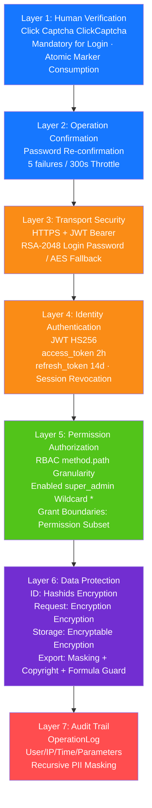

> Copyright (c) 2026 erik <erik@erik.xyz> — https://erik.xyz
>
> [中文](11-security-defense.md) | [English](11-security-defense.en.md)

# Security Defense in Depth

```mermaid
flowchart TB
    l1["Layer 1: Human Verification<br/>Click Captcha ClickCaptcha<br/>Mandatory for Login · Atomic Marker Consumption"]
    l2["Layer 2: Operation Confirmation<br/>Password Re-confirmation<br/>5 failures / 300s Throttle"]
    l3["Layer 3: Transport Security<br/>HTTPS + JWT Bearer<br/>RSA-2048 Login Password / AES Fallback"]
    l4["Layer 4: Identity Authentication<br/>JWT HS256<br/>access_token 2h<br/>refresh_token 14d · Session Revocation"]
    l5["Layer 5: Permission Authorization<br/>RBAC method.path Granularity<br/>Enabled super_admin Wildcard *<br/>Grant Boundaries: Permission Subset"]
    l6["Layer 6: Data Protection<br/>ID: Hashids Encryption<br/>Request: Encryption Encryption<br/>Storage: Encryptable Encryption<br/>Export: Masking + Copyright + Formula Guard"]
    l7["Layer 7: Audit Trail<br/>OperationLog<br/>User/IP/Time/Parameters<br/>Recursive PII Masking"]

    l1 --> l2 --> l3 --> l4 --> l5 --> l6 --> l7

    style l1 fill:#1677FF,color:#fff
    style l2 fill:#1677FF,color:#fff
    style l3 fill:#FA8C16,color:#fff
    style l4 fill:#FA8C16,color:#fff
    style l5 fill:#52C41A,color:#fff
    style l6 fill:#722ED1,color:#fff
    style l7 fill:#FF4D4F,color:#fff
```
