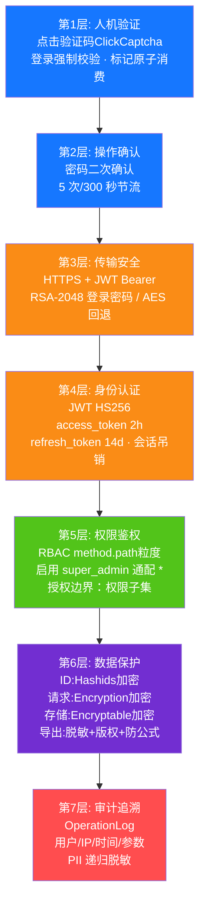

# 安全纵深防御

```mermaid
flowchart TB
    l1["第1层: 人机验证<br/>点击验证码ClickCaptcha<br/>登录强制校验 · 标记原子消费"]
    l2["第2层: 操作确认<br/>密码二次确认<br/>5 次/300 秒节流"]
    l3["第3层: 传输安全<br/>HTTPS + JWT Bearer<br/>RSA-2048 登录密码 / AES 回退"]
    l4["第4层: 身份认证<br/>JWT HS256<br/>access_token 2h<br/>refresh_token 14d · 会话吊销"]
    l5["第5层: 权限鉴权<br/>RBAC method.path粒度<br/>启用 super_admin 通配 *<br/>授权边界：权限子集"]
    l6["第6层: 数据保护<br/>ID:Hashids加密<br/>请求:Encryption加密<br/>存储:Encryptable加密<br/>导出:脱敏+版权+防公式"]
    l7["第7层: 审计追溯<br/>OperationLog<br/>用户/IP/时间/参数<br/>PII 递归脱敏"]

    l1 --> l2 --> l3 --> l4 --> l5 --> l6 --> l7

    style l1 fill:#1677FF,color:#fff
    style l2 fill:#1677FF,color:#fff
    style l3 fill:#FA8C16,color:#fff
    style l4 fill:#FA8C16,color:#fff
    style l5 fill:#52C41A,color:#fff
    style l6 fill:#722ED1,color:#fff
    style l7 fill:#FF4D4F,color:#fff
```
