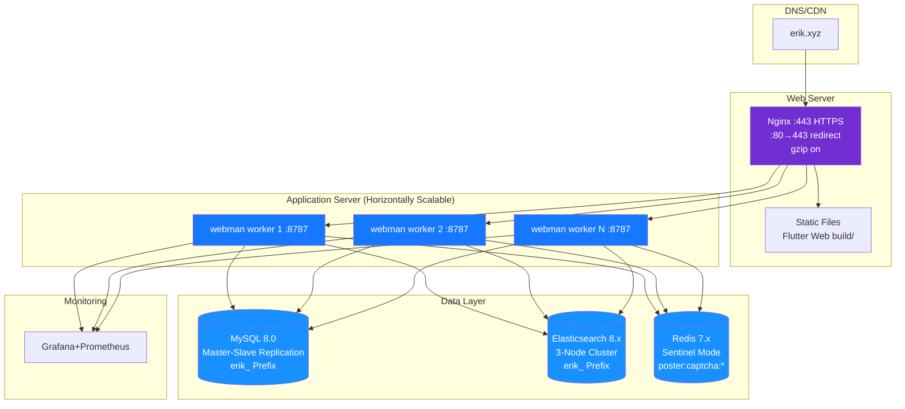

> Copyright (c) 2026 erik <erik@erik.xyz> — https://erik.xyz
>
> [中文](12-deployment.md) | [English](12-deployment.en.md) | [한국어](12-deployment.ko.md) | [Русский](12-deployment.ru.md) | [Deutsch](12-deployment.de.md) | [Français](12-deployment.fr.md) | [Español](12-deployment.es.md) | [Português](12-deployment.pt.md) | [हिन्दी](12-deployment.hi.md) | [العربية](12-deployment.ar.md) | [বাংলা](12-deployment.bn.md) | [Bahasa Indonesia](12-deployment.id.md) | [日本語](12-deployment.ja.md)

# Deployment Topology

