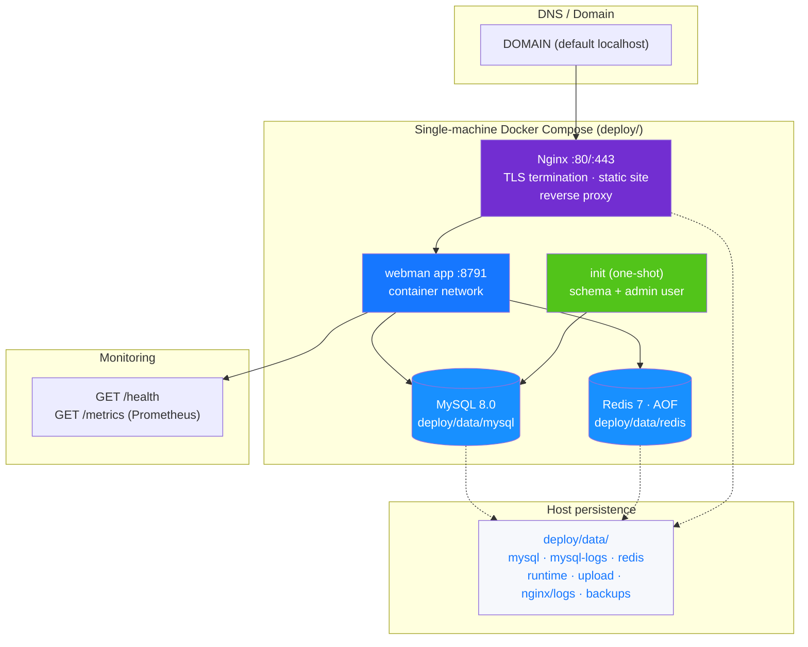

> Copyright (c) 2026 erik <erik@erik.xyz> — https://erik.xyz
>
> [中文](12-deployment.md) | [English](12-deployment.en.md)

# Deployment Topology

```mermaid
flowchart TB
    subgraph dns["DNS / Domain"]
        domain["DOMAIN (default localhost)"]
    end

    subgraph host["Single-machine Docker Compose (deploy/)"]
        nginx["Nginx :80/:443<br/>TLS termination · static site<br/>reverse proxy"]
        bootstrap["init (one-shot)<br/>schema + admin user"]
        wm["webman app :8791<br/>container network"]
        mysql[("MySQL 8.0<br/>deploy/data/mysql")]
        redis[("Redis 7 · AOF<br/>deploy/data/redis")]
    end

    subgraph persist["Host persistence"]
        data["deploy/data/<br/>mysql · mysql-logs · redis<br/>runtime · upload · nginx/logs · backups"]
    end

    subgraph monitor["Monitoring"]
        health["GET /health<br/>GET /metrics (Prometheus)"]
    end

    domain --> nginx
    nginx --> wm
    wm --> mysql
    wm --> redis
    bootstrap --> mysql
    mysql -.-> data
    redis -.-> data
    nginx -.-> data
    wm --> health

    style nginx fill:#722ED1,color:#fff
    style bootstrap fill:#52C41A,color:#fff
    style wm fill:#1677FF,color:#fff
    style mysql fill:#1890FF,color:#fff
    style redis fill:#1890FF,color:#fff
    style data fill:#F6F8FC,color:#1677FF
```
