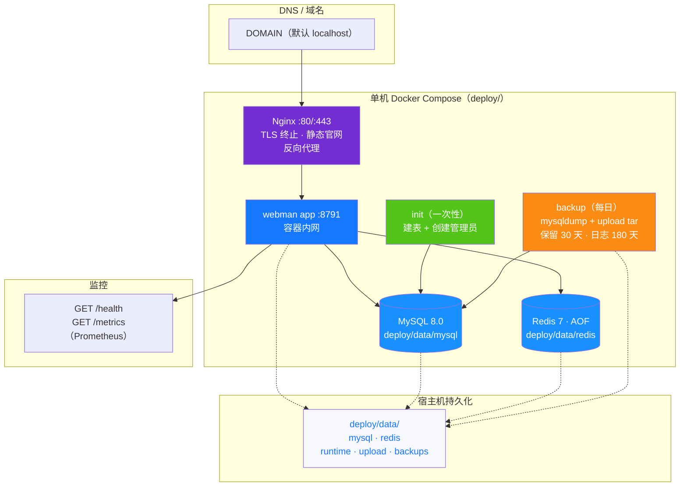

# 部署拓扑

```mermaid
flowchart TB
    subgraph dns["DNS / 域名"]
        domain["DOMAIN（默认 localhost）"]
    end

    subgraph host["单机 Docker Compose（deploy/）"]
        nginx["Nginx :80/:443<br/>TLS 终止 · 静态官网<br/>反向代理"]
        bootstrap["init（一次性）<br/>建表 + 创建管理员"]
        wm["webman app :8791<br/>容器内网"]
        mysql[("MySQL 8.0<br/>deploy/data/mysql")]
        redis[("Redis 7 · AOF<br/>deploy/data/redis")]
        backup["backup（每日）<br/>mysqldump + upload tar<br/>保留 30 天 · 日志 180 天"]
    end

    subgraph persist["宿主机持久化"]
        data["deploy/data/<br/>mysql · redis<br/>runtime · upload · backups"]
    end

    subgraph monitor["监控"]
        health["GET /health<br/>GET /metrics（Prometheus）"]
    end

    domain --> nginx
    nginx --> wm
    wm --> mysql
    wm --> redis
    bootstrap --> mysql
    backup --> mysql
    wm -.-> data
    mysql -.-> data
    redis -.-> data
    backup -.-> data
    wm --> health

    style nginx fill:#722ED1,color:#fff
    style bootstrap fill:#52C41A,color:#fff
    style wm fill:#1677FF,color:#fff
    style mysql fill:#1890FF,color:#fff
    style redis fill:#1890FF,color:#fff
    style backup fill:#FA8C16,color:#fff
    style data fill:#F6F8FC,color:#1677FF
```
